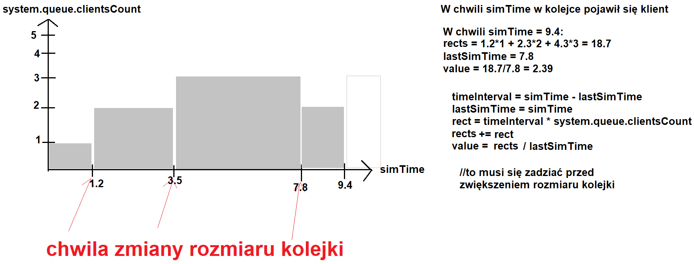
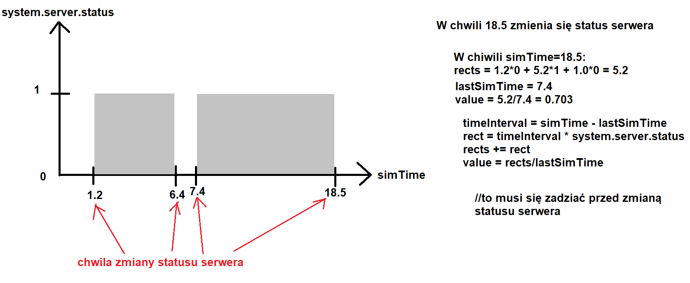

# M/M/1 - Weighted Round Robin - Poisson

## Stage 1 - Simple M/M/1

W pierwszej fazie implementujemy czyste M/M/1, dopiero potem będzie ono rozwinięte o WRR i Poissona. 

### Model systemu

**System** - pewien zbiór elementów oraz powiązań między nimi, które współdziałają, aby osiągnąć pewne logiczne zakończenie działania.

> U nas systemem jest **kolejka** oraz **serwer**, które współdziałają aby obsłużyć napływ **klientów** do systemu. Powiązaniem jest to, że **serwer**, gdy jest wolny pobiera **klienta** oczekującego w **kolejce**, do obsługi. Logicznym zakończeniem działania jest obsługa pojedynczego klienta przez serwer.

**Model systemu** - zbiór elementów systemu, ich atrybutów/cech/zachowań oraz powiązań między nimi.

> U nas elementami są **kolejka** oraz **serwer**. 
>
> Atrybuty *kolejki*, to:
>
> - **liczba oczekujących w niej klientów**,
> - **czasy przybycia do systemu każdego z klientów**.  
>
> Zachowania *kolejki*, to:
>
> - dekrementacja *liczby oczekujących w niej klientów* w momencie, gdy serwer pobiera klienta do obsługi
> - inkrementacja *liczby oczekujących w niej klientów* w momencie, przybycia *klienta* do systemu
>
> Atrybuty *Serwera*, to:
>
> - **status serwera**, mówiący o tym, czy obsługuje on w danym momencie klienta czy nie
>
> Zachowania serwera, to:
>
> - pobranie klienta z kolejki do obsługi, gdy *status serwera* wskazuje, że jest on `wolny`
> - zmiana statusu serwera na `zajęty` podczas obsługi klienta

**Stan systemu** - Zbiór zmiennych koniecznych do opisania systemu w danej chwili czasowej.

> U nas tym zbiorem zmiennych jest:
>
> - `Server_Status` - określający czy serwer jest zajęty czy nie (`BUSY` lub `FREE`). Konieczny do określenia czy przybywający klient może przejść natychmiast do obsługi, czy musi poczekać
> - `Clients_Number_In_Queue` - określający liczbę klientów w kolejce oczekujących na obsługę. Po zakończeniu obsługi klienta przez serwer, pozwala stwierdzić czy serwer przechodzi w stan zajęty czy wolny
> - `Client::Arrival_Time` - czas przybycia każdego klienta. Pozwala obliczyć czas oczekiwania na obsłużenie przez serwer.

**Zdarzenia** - chwilowe działanie, które MOŻE spowodować zmianę *stanu systemu*.

> U nas typy zdarzeń są dwa*:
>
> - `ARRIVAL` - przybycie klienta do systemu.
>   - Powoduje zmianę stanu systemu
>     - albo zmiana `Server_Status` z `FREE` na `BUSY`
>     - albo inkrementacja `Clients_Number_In_Queue`
> - `DEPARTURE` - zakończenie obsługi klienta przez serwer i opuszczenie systemu
>   - Powoduje zmianę stan systemu
>     - zmiana `Server_Status` na `FREE`
>
> *Możliwe dodanie typu zdarzenia `END`, powodującego zatrzymanie symulacji (nie zmienia stanu systemu).

## Moduły symulacji

- stan systemu 

  - Zbiór zmiennych koniecznych do opisania systemu w danej chwili czasowej.

  - `Server_Status`, `Clients_Number_In_Queue`, `Client::Arrival_Time`

  - > Widzę tu kandydatów na klasy:
    >
    > System::Server
    >
    > System::Queue
    >
    > System::Client (co prawda klient nie stanowi stałego elementu sytemu, ale uznajemy, że gdy się w nim pojawia takim elementem zostaje).
    >
    > po których rozejdą się te zmienne opisujące stan systemu

- zegar symulacji
  - bieżący czas symulacji
  - `SIM_TIME`
- lista zdarzeń
  - lista zawierająca czas wystąpienia kolejnego zdarzenia w systemie dla każdego z typów zdarzeń
  - `EVENT_LIST`
- algorytm inicjalizujący
  - inicjalizuje model w chwili `zegar symulacji` = 0
  - `Algorithm::init`
- algorytm czasowy
  - określa kolejne zdarzenie z listy zdarzeń i zwiększa zegar symulacji na czas wystąpienia tego zdarzenia
  - `Algorithm::time`
- algorytm zdarzeniowy
  - uaktualnia stan systemu, kiedy wystąpi kolejne zdarzenie, planuje kolejne zdarzenie
  - `Algorithm::EventArrival`,  `Algorithm::EventDeparture`
- algorytm bibliotek
  - zbiór bibliotek do generowania zmiennych losowych (A i S)
  - `Algorithm::LibArrival`, `Algorithm::LibDeparture`
- generator raportów
  - oblicza charakterystyki systemu na podstawie zmierzonych wartości i generuje raport po zakończeniu symulacji
  - `RaportGenerator`
- program główny
  - wywołuje to wszystko

## Program główny

Diagramy aktywności UML prezentujące działanie programu oraz poszczególnych algorytmów.

## Implementacja

//TODO Tu pojawią się niebawem diagramy UML prezentujące klasy C++.

## Zbierane statystki

### Średni czas oczekiwania w kolejce (d)

`delayAccumulated` - suma czasów oczekiwania klientów od 0 do `i`

`delaysNumber` - liczba czasów oczekiwania

`delayMean` -  średni czas oczekiwania w kolejce klientów

### Liczba czasów w kolejce oszacowana w czasie ciągłym (q)

### Wykorzystanie serwera obsługi (u)

