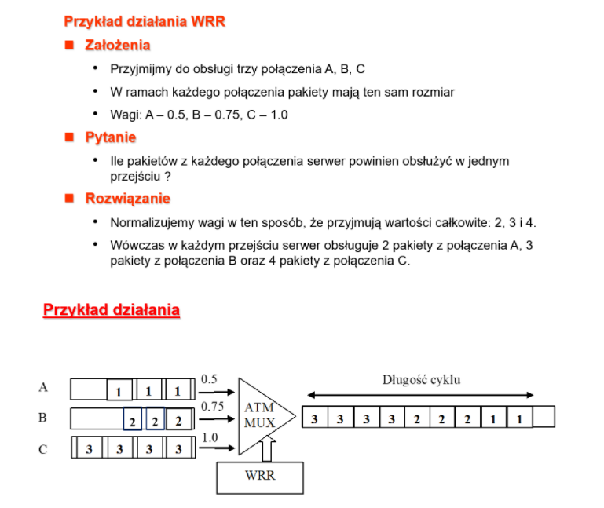
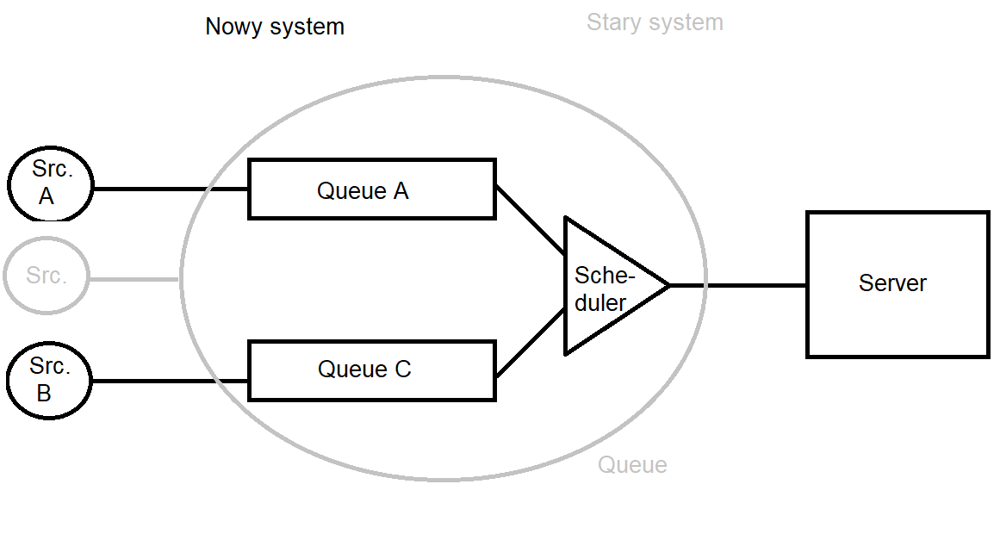
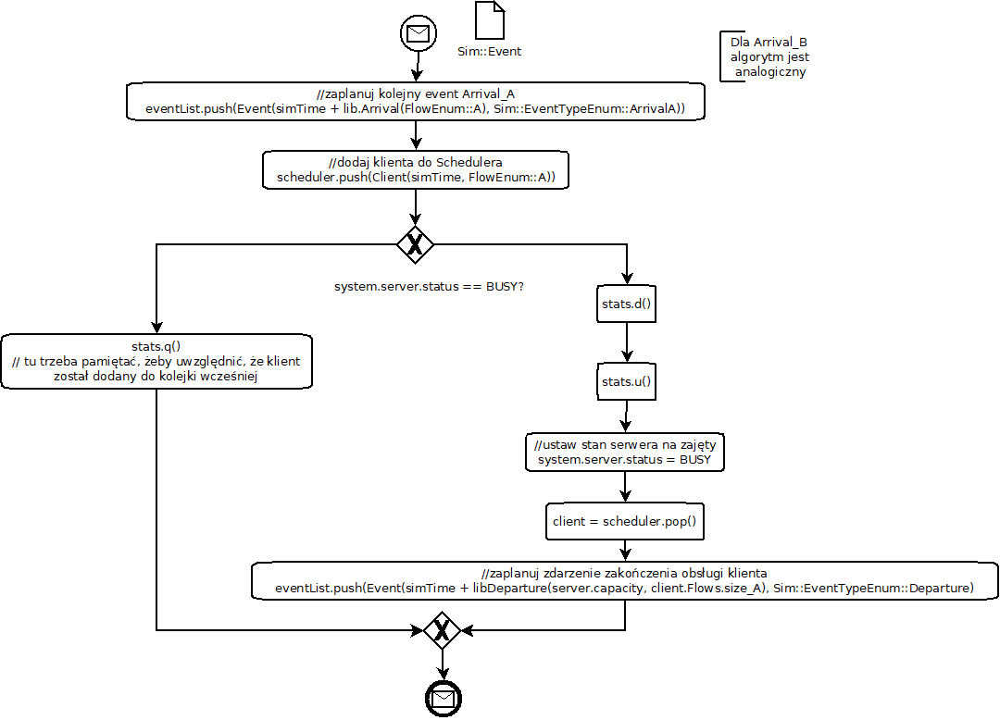
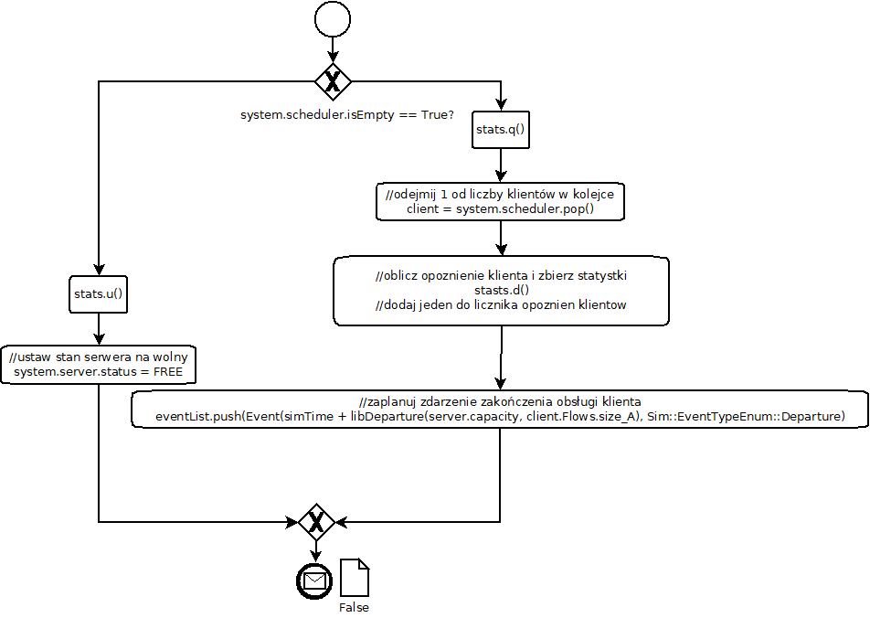
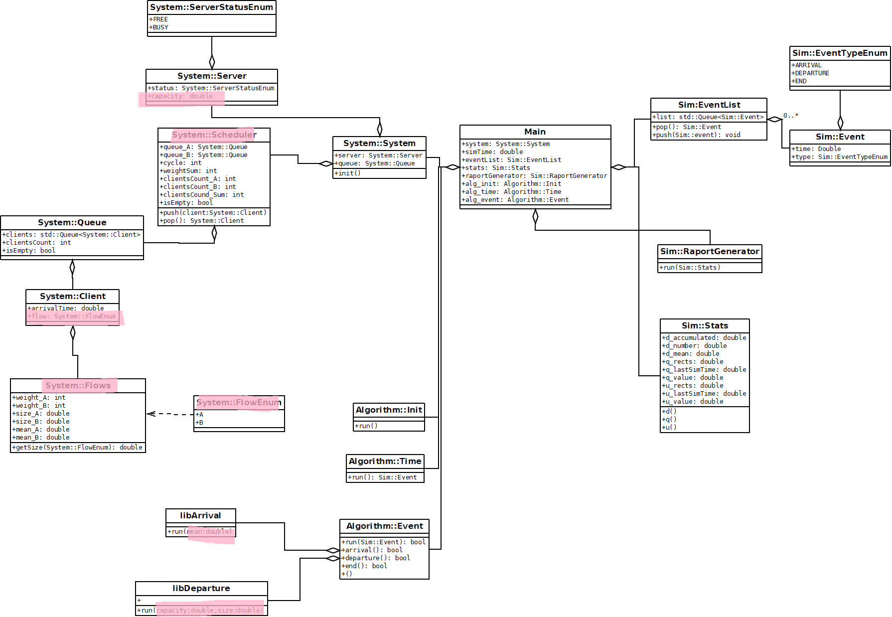

# M/M/1 - Weighted Round Robin - Poisson

Spis treści:

1. [Stage 1 - Simple M/M/1](#1-stage-1-1---simple-MM1)
   1. [Model systemu](#11-model-systemu)
   2. [Moduly sumulacji](#12-moduły-symulacji)
   3. [Program główny](#13-program-główny)
   4. [Diagram klas](#14-diagram-klas)
   5. [Zbierane statystyki](#15-zbierane-statystyki)
   6. [Walidacja poprawności](#16-walidacja-poprawności)

## 1 Stage 1 - Simple M/M/1

W pierwszej fazie implementujemy czyste M/M/1, dopiero potem będzie ono rozwinięte o WRR i Poissona. 

### 1.1 Model systemu

**System** - pewien zbiór elementów oraz powiązań między nimi, które współdziałają, aby osiągnąć pewne logiczne zakończenie działania.

> U nas systemem jest **kolejka** oraz **serwer**, które współdziałają aby obsłużyć napływ **klientów** do systemu. Powiązaniem jest to, że **serwer**, gdy jest wolny pobiera **klienta** oczekującego w **kolejce**, do obsługi. Logicznym zakończeniem działania jest obsługa pojedynczego klienta przez serwer.

**Model systemu** - zbiór elementów systemu, ich atrybutów/cech/zachowań oraz powiązań między nimi.

> U nas elementami są **kolejka** oraz **serwer**. 
>
> Atrybuty *kolejki*, to:
>
> - **liczba oczekujących w niej klientów**,
> - **czasy przybycia do systemu każdego z klientów**.  
>
> Zachowania *kolejki*, to:
>
> - dekrementacja *liczby oczekujących w niej klientów* w momencie, gdy serwer pobiera klienta do obsługi
> - inkrementacja *liczby oczekujących w niej klientów* w momencie, przybycia *klienta* do systemu
>
> Atrybuty *Serwera*, to:
>
> - **status serwera**, mówiący o tym, czy obsługuje on w danym momencie klienta czy nie
>
> Zachowania serwera, to:
>
> - pobranie klienta z kolejki do obsługi, gdy *status serwera* wskazuje, że jest on `wolny`
> - zmiana statusu serwera na `zajęty` podczas obsługi klienta

**Stan systemu** - Zbiór zmiennych koniecznych do opisania systemu w danej chwili czasowej.

> U nas tym zbiorem zmiennych jest:
>
> - `Server.status` - określający czy serwer jest zajęty czy nie (`BUSY` lub `FREE`). Konieczny do określenia czy przybywający klient może przejść natychmiast do obsługi, czy musi poczekać
> - `Queue.clientsCount` - określający liczbę klientów w kolejce oczekujących na obsługę. Po zakończeniu obsługi klienta przez serwer, pozwala stwierdzić czy serwer przechodzi w stan zajęty czy wolny
> - `Client.arrivalTime` - czas przybycia każdego klienta. Pozwala obliczyć czas oczekiwania na obsłużenie przez serwer.

**Zdarzenia** - chwilowe działanie, które MOŻE spowodować zmianę *stanu systemu*.

> U nas typy zdarzeń są dwa*:
>
> - `ARRIVAL` - przybycie klienta do systemu.
>   - Powoduje zmianę stanu systemu
>     - albo zmiana `Server.status` z `FREE` na `BUSY`
>     - albo inkrementacja `Queue.clientsCount`
> - `DEPARTURE` - zakończenie obsługi klienta przez serwer i opuszczenie systemu
>   - Powoduje zmianę stan systemu
>     - zmiana `Server.status` na `FREE`
>
> *Możliwe dodanie typu zdarzenia `END`, powodującego zatrzymanie symulacji (nie zmienia stanu systemu).

### 1.2 Moduły symulacji

- stan systemu 

  - Zbiór zmiennych koniecznych do opisania systemu w danej chwili czasowej.
- `System::Server::status`, `System::Queue::clientsCount`, `System::Client::arrivalTime`
- zegar symulacji
  - bieżący czas symulacji
  - `simTime`
- lista zdarzeń
  - lista zawierająca czas wystąpienia kolejnego zdarzenia w systemie dla każdego z typów zdarzeń
  - `Sim::EventList`
- algorytm inicjalizujący
  - inicjalizuje model w chwili `zegar symulacji` = 0
  - `Algorithm::init`
- algorytm czasowy
  - określa kolejne zdarzenie z listy zdarzeń i zwiększa zegar symulacji na czas wystąpienia tego zdarzenia
  - `Algorithm::time`
- algorytm zdarzeniowy
  - uaktualnia stan systemu, kiedy wystąpi kolejne zdarzenie, planuje kolejne zdarzenie
  - `Algorithm::EventArrival`,  `Algorithm::EventDeparture`
- algorytm bibliotek
  - zbiór bibliotek do generowania zmiennych losowych (odstępów czasowych między przybywającymi klientami, czasów obsługi klientów przez serwer)
  - `Algorithm::LibArrival`, `Algorithm::LibDeparture`
- generator raportów
  - oblicza charakterystyki systemu na podstawie zmierzonych wartości i generuje raport po zakończeniu symulacji
  - `Sim::RaportGenerator`
    - Okazuje, się że statystki trzeba zbierać podczas działania symulacji non-stop (nie tylko na koniec), więc wydzielono do tego klasę `Sim::Stats`
- program główny
  - wywołuje to wszystko
  - `Program`

### 1.3 Program główny

Diagramy aktywności UML prezentujące działanie programu oraz poszczególnych algorytmów.

#### 1.3.1 Algorytm Inicjujący 

#### 1.3.2 Algorytm czasowy

#### 1.3.3 Algorytm zdarzeniowy

##### 1.3.3.1 ARRIVAL

##### 1.3.3.2 DEPARTURE

##### 1.3.3.3 END

### 1.4 Diagram klas

### 1.5 Zbierane statystyki

#### 1.5.1 Średni czas oczekiwania w kolejce (d)

`delayAccumulated` - suma czasów oczekiwania klientów od 0 do `i`

`delaysNumber` - liczba czasów oczekiwania

`delayMean` -  średni czas oczekiwania w kolejce klientów

#### 1.5.2 Liczba kleintów w kolejce oszacowana w czasie ciągłym (q)

> UWAGA na obrazku jest gdzieś błąd. Wiem, że zauważyłem, ale nie zmieniłem tego i już zapomniałem co tu jest źle, więc jak znajdziesz tu coś źle, to uznaj, że to ten błąd xd

#### 1.5.3 Wykorzystanie serwera obsługi (u)

> UWAGA na obrazku jest gdzieś błąd. Wiem, że zauważyłem, ale nie zmieniłem tego i już zapomniałem co tu jest źle, więc jak znajdziesz tu coś źle, to uznaj, że to ten błąd xd

### 1.6 Walidacja poprawności

> Przy czym należy pamiętać, że rozkład wykładniczy ma następującą właściwość.
>
> 
>
> np. gdy ustawimy λ=1/2, to nowi klienci będą się pojawiać się średnio co 2 jednostki czasu

Wartości ` λ` i `μ` przyjmujemy jako parametry wejściowe symulacja. 

Walidacja czy symulacja jest wykonana poprawnie jest sprawdzenie czy wyniki jej doświadczeń zgadzają się z modelem matematycznym. Mówiąc prościej - dla zadanych ` λ` i `μ`, należy sprawdzić poprawność wzorów:

#### 1.6.1 Przykład

Parametry wejściowe symulacji:

λ = 1/2

μ = 1

Wyliczone `ρ` i  `W`:

ρ = 1/2

W = 1

Wyniki symulacji:

Uzyskane wyniki symulacji pozwalają stwierdzić, że system zaimplementowany jest poprawnie*

W miarę odpalania kolejnych prób symulacji i liczenia wartości średniej z uzyskanych wyników, będzie się ona przybliżać do wartości obliczonych zgodnie z modelem matematycznym. Można też po prostu zwiększyć czas symulacji.

>  *Oczywiście w celu sprawdzenia pełnej poprawności należy powtórzyć przykład dla innych wartość  λ i μ. (ważne przy ich dobieraniu jest to, aby ρ nie wyszło większe od 1 ==> oznaczało by to obciążenie systemu na więcej niż potrafi)

#### 1.6.2 Gdzie się zmienia wejściowe parametry?

Wejściowe parametry, czyli:

1/λ - średni odstęp czasowy między klientami napływającymi do systemu

1/μ - średni czasu obsługi klientów przez serwer

Zmienia się w odpowiednio plikach:*

`src/algorithm/LibArrivalExp.h`

`src/algorithm/LibDepartureExp.h`

jako wartość pola `MEAN`

> *od strony programistycznej takie rozwiązanie ssie, ale parametryzacja klasy Algorithm::Events poprzez przyjmowanie obiektów typu Algorithm::ILibArrival, Algorithm::ILibDeparture, którym podawane by były obiekty Algorithm::LibArrival, Algorithm::LibDeparture z odpowiednio ustawionym MEAN w ich konstruktorach, a to z kolei w konstruktorze klasy Program (co programistycznie by było ideałem), utrudniło by zrozumienie systemu.

##### 1.6.2.1 Przykład

Tutaj λ jest ustawiona na 2.

## 2 Stage 2 - Weighted Round Robin

### 2.1 Teoria

WRR jest emulacją metody GPS (Generalized Process Sharing).

W ramach każdego **strumienia**, **klienci** (**pakiety**) umieszczani są w osobnych **kolejkach**. 

WRR sprawdza każdą *kolejkę* w pętli (cyklicznie) obsługując małą część danych z każdej *kolejki*.

*Strumienie* mogą być skojarzone z **wagą**, wówczas te małe części są w proporcji do przydzielonych *wag*.

Zakładamy, że wszystkie pakiety mają ten sam rozmiar.

### 2.2 Nowe elementy modelu

**Strumienie** - teraz klienci pojawiają się w systemie w ramach jakiegoś strumienia. Strumień cechuję to, że ma swoją *wagę*, oraz że wszyscy klienci z danego strumienia mają ten sam *rozmiar*).

> W symulacji wystarczą tylko dwa strumienie.

**Wagi** - każdy strumień opisany jest przez swoją wagę, która odzwierciedla jego priorytetyzację w algorytmie WRR.

**Rozmiar** - ma znaczenie przy obliczaniu czasu obsługi danego klienta. Teraz czas obsługi przez serwer nie jest dany rozkładem wykładniczym, a jest obliczany na podstawie **przepustowości** serwera i rozmiaru klienta.

**Źródła** - każdy ze *strumieni* ma swoje **źródło**. Przy czym *źródło* charakteryzuje się rozkładem intensywności napływu (np. wykładniczy). Złożenie ruchu z kilku źródeł tworzy ruch Poissona.

> Przykładowo dwa źródła mogą mieć rozkład wykładniczy, ale o różnej wartości średniej.

**Wagi** - każdy strumień opisany jest przez swoją wagę, która odzwierciedla jego priorytetyzację w algorytmie WRR.

**Scheduler**  - klienci pojawiający się w ramach danego *strumienia* trafiają do przypisanej mu kolejki. Zadaniem **Schedulera** jest wykonywanie algorytmu WRR, który odpowiednio przenosi klientów z kolejek przypisanych strumieniom, do serwera obsługi.

Co się zmienia względem starego systemu?

- To, że pakiety przybywają teraz z dwóch niezależnych źródeł.

- To, że Queue zostaje zastąpione przez dwie kolejki i Scheduler.

Reszta pozostaje bez zmian. Tak więc powinna się zmienić jedynie:

- obsługa przybycia klienta - na taką która uwzględnia strumienie
- implementacja/środek kolejki - ale komunikacja z nią powinna pozostać nienaruszona

### 2.3 Zmiany

#### 2.3.1 Obsługa przybycia klienta

Aby zachować niezależność źródeł należy pojedyncze zdarzenie ARRIVAL zastąpić przez ARRIVAL_A, ARRIVAL_B (żeby na eventList było zawsze po jednym zdarzeniu z tych typów).

Poprzednio po przybyciu sprawdzano czy server.status == FREE, 

- jeśli tak pakiet trafiał od razu do obsługi. Tak też pozostanie i teraz (z tym, że Scheduler musi zmienić swój stan, ale o tym potem)
- jeśli nie pakiet trafiał do kolejki. Tutaj zmieni się tylko to, że pakiet trafia do jednej z dwóch kolejek w zależności, do którego strumienia należy.

> Skoro tworzymy klienta w momencie, kiedy znamy źródło z którego przybył, możemy dodać do klienta informację o strumieniu. Może to się przydać przy statystykach.

#### 2.3.2 Implementacja/środek kolejki

Wcześniej była pojedyncza kolejka, która używana była tylko w dwóch przypadkach:

- podczas ARRIVAL gdy server był BUSY - client był do niej dodawany
- podczas DEPARTURE, gdy server pobierał do obsługi kolejnego klienta - kolejka zwracała następny pakiet do obsługi

Teraz będzie tak samo, lecz zamiast dodawać/brać do/z Queue, będziemy dodawać/brać do/z Scheduler.

Scheduler w sobie będzie miał dwie kolejki, dzięki którym będzie wykonywał WRR.

> Także programistycznie wychodzi, że Scheduler będzie implementował ten sam interfejs co Queue

Czyli z punktu widzenia systemu teraz zamiast Queue, będzie Scheduler (i cały WRR jest na jego barkach).

### 2.4 Klasy

Po pierwsze pojawi się nowa klasa statyczna  `System::Flows`, o polach `weight_A`, `weight_B` i `size_A`, `size_B` , `mean_A`, `mean_B` określające wagi, 1/λ rozkładu i rozmiary klientów danego flow.

W klasie `System::Client` pojawi się pole `flow` przyjmujące wartości z enuma `flowEnum {A, B}`.

W klasie `System::Server` pojawi się pole `capacity` typu określające przepustowość (na jej podstawie oraz rozmiaru klienta liczony będzie czas obsługi).

Metoda `Algorithm::LibDeparture.run()` będzie teraz przyjmowała dwa argumenty `capacity` i `size`, i na tej podstawie zwracała czas obsługi klienta.

Metoda `Algorithm::LibArrival.run()` będzie przyjmowała wartość `MEAN`, która będzie podawana zgodnie z danym flow.

Powstanie nowa klasa `System::Scheduler`, który zastąpi `System::Queue`. Polami tej klasy będą `queue_A` i `queue_B` typu `System::Queue` oraz zmienna `cycle` określająca stan cyklu Schedulera.

### 2.5 Implementacja Schedulera

Scheduler musi implementować algorytm WRR (Weighted Round Robin) oraz zachowywać się tak jak `System::Queue`.

### 2.5.1 Wyjaśnienie WRR

Zasadę działania Schedulera łatwo wyjaśnić na konkretnych wagach. Załóżmy wagi:

1 dla flow A

2 dla flow B

Długość cyklu w tym przypadku wynosi `3` (suma wag). 

Mamy zmienną `cycle`, która określa moment cyklu. Może ona przyjmować wartości `1,2,3`. 

Ogólnie Scheduler ma zwracać serwerowi klienta do obsługi i cała prostota rozwiązania polega na tym, że zwraca on klienta z kolejki, która jest określona na podstawie zmiennej `cycle`.

Funkcja, która opisuje z której kolejki zwrócić pakiet, gdzie parametrem jest `cycle` wygląda następująco:

- `queue_A`, gdy `cycle == 1 || 2`
- `queue_B`, gdy `cycle == 3`

Następnie, po zwróceniu klienta inkrementuje on zmienną `cycle` (`cycle++`).

Gdy jednak kolejka, na którą wskazuje `cycle` jest pusta. Scheduler zwraca klienta z drugiej kolejki przeskakując odpowiednio zmienną `cycle`, tak aby wskazać, że zwrócił właśnie klienta z tej kolejki. 

> Czyli gdy `cycle` wskazuje na `queue_A`, ale jest ona pusta to zwraca ` queue_B` i zmienną `cycle` ustawia na `3+1=4`.
>
> Zaś gdy `cycle` wskazuje na `queue_B`, ale jest ona pusta to zwraca `queue_A`  i zmienną `cycle` ustawia na `1+1=2`.
>
> Takie coś symuluje to, że WRR omija puste kolejki, ale zalicza to do przebiegnięcia cyklu.

### 2.5.3 Kiedy WRR jest uruchamiany?

Wtedy gdy Scheduler ma przekazać klienta serwerowi. Czyli dwie sytuacje

- Do systemu przybył klient i server jest FREE                ---> Event Arrival
- Server skończył obsługę klienta i pyta o następnego ---> Event Departure

### 2.6 Nowe algorytmy zdarzeniowe

### 2.6.1 Arrival_A, Arrival_B

#### 2.6.1 Departure

### 2.7 Nowy diagram klas

## 2.8 Nowe statystki

Wcześniej liczone były następujące staty:

- Średni czas oczekiwania w kolejce (d)
- Liczba klientów w kolejce oszacowana w czasie ciągłym (q)
- Wykorzystanie serwera obsługi (u)

Teraz z racji, że kolejki są dwie, można policzyć również można policzyć te same staty:

- dla strumienia A
- dla strumienia B
- sumarycznie oba strumienie

No oprócz wykorzystania serwera obsługi, bo serwer jest still jeden.

### 2.8.1 Zmiany w implementacji

Zmienne w klasie `Sim::Stats` zamienią się po prostu w tablice 3-elementowe.

0 - suma

1 - strumień A

2 - strumień B

Do liczenia sumy pozostaną metody, które są już zaimplementowane. Do liczenia strumienia powstanie metoda, która jako parametr przyjmuje `System::FlowEnum`.

