# M/M/1 - Weighted Round Robin - Poisson

## Stage 1 - Simple M/M/1

W pierwszej fazie implementujemy czyste M/M/1, dopiero potem będzie ono rozwinięte o WRR i Poissona. 

### Model systemu

**System** - pewien zbiór elementów oraz powiązań między nimi, które współdziałają, aby osiągnąć pewne logiczne zakończenie działania.

> U nas systemem jest **kolejka** oraz **serwer**, które współdziałają aby obsłużyć napływ **klientów** do systemu. Powiązaniem jest to, że **serwer**, gdy jest wolny pobiera **klienta** oczekującego w **kolejce**, do obsługi. Logicznym zakończeniem działania jest obsługa pojedynczego klienta przez serwer.

**Model systemu** - zbiór elementów systemu, ich atrybutów/cech/zachowań oraz powiązań między nimi.

> U nas elementami są **kolejka** oraz **serwer**. 
>
> Atrybuty *kolejki*, to:
>
> - **liczba oczekujących w niej klientów**,
> - **czasy przybycia do systemu każdego z klientów**.  
>
> Zachowania *kolejki*, to:
>
> - dekrementacja *liczby oczekujących w niej klientów* w momencie, gdy serwer pobiera klienta do obsługi
> - inkrementacja *liczby oczekujących w niej klientów* w momencie, przybycia *klienta* do systemu
>
> Atrybuty *Serwera*, to:
>
> - **status serwera**, mówiący o tym, czy obsługuje on w danym momencie klienta czy nie
>
> Zachowania serwera, to:
>
> - pobranie klienta z kolejki do obsługi, gdy *status serwera* wskazuje, że jest on `wolny`
> - zmiana statusu serwera na `zajęty` podczas obsługi klienta

**Stan systemu** - Zbiór zmiennych koniecznych do opisania systemu w danej chwili czasowej.

> U nas tym zbiorem zmiennych jest:
>
> - `Server.status` - określający czy serwer jest zajęty czy nie (`BUSY` lub `FREE`). Konieczny do określenia czy przybywający klient może przejść natychmiast do obsługi, czy musi poczekać
> - `Queue.clientsCount` - określający liczbę klientów w kolejce oczekujących na obsługę. Po zakończeniu obsługi klienta przez serwer, pozwala stwierdzić czy serwer przechodzi w stan zajęty czy wolny
> - `Client.arrivalTime` - czas przybycia każdego klienta. Pozwala obliczyć czas oczekiwania na obsłużenie przez serwer.

**Zdarzenia** - chwilowe działanie, które MOŻE spowodować zmianę *stanu systemu*.

> U nas typy zdarzeń są dwa*:
>
> - `ARRIVAL` - przybycie klienta do systemu.
>   - Powoduje zmianę stanu systemu
>     - albo zmiana `Server.status` z `FREE` na `BUSY`
>     - albo inkrementacja `Queue.clientsCount`
> - `DEPARTURE` - zakończenie obsługi klienta przez serwer i opuszczenie systemu
>   - Powoduje zmianę stan systemu
>     - zmiana `Server.status` na `FREE`
>
> *Możliwe dodanie typu zdarzenia `END`, powodującego zatrzymanie symulacji (nie zmienia stanu systemu).

### Moduły symulacji

- stan systemu 

  - Zbiór zmiennych koniecznych do opisania systemu w danej chwili czasowej.
- `System::Server::status`, `System::Queue::clientsCount`, `System::Client::arrivalTime`
- zegar symulacji
  - bieżący czas symulacji
  - `simTime`
- lista zdarzeń
  - lista zawierająca czas wystąpienia kolejnego zdarzenia w systemie dla każdego z typów zdarzeń
  - `Sim::EventList`
- algorytm inicjalizujący
  - inicjalizuje model w chwili `zegar symulacji` = 0
  - `Algorithm::init`
- algorytm czasowy
  - określa kolejne zdarzenie z listy zdarzeń i zwiększa zegar symulacji na czas wystąpienia tego zdarzenia
  - `Algorithm::time`
- algorytm zdarzeniowy
  - uaktualnia stan systemu, kiedy wystąpi kolejne zdarzenie, planuje kolejne zdarzenie
  - `Algorithm::EventArrival`,  `Algorithm::EventDeparture`
- algorytm bibliotek
  - zbiór bibliotek do generowania zmiennych losowych (odstępów czasowych między przybywającymi klientami, czasów obsługi klientów przez serwer)
  - `Algorithm::LibArrival`, `Algorithm::LibDeparture`
- generator raportów
  - oblicza charakterystyki systemu na podstawie zmierzonych wartości i generuje raport po zakończeniu symulacji
  - `Sim::RaportGenerator`
    - Okazuje, się że statystki trzeba zbierać podczas działania symulacji non-stop (nie tylko na koniec), więc wydzielono do tego klasę `Sim::Stats`
- program główny
  - wywołuje to wszystko
  - `Program`

### Program główny

Diagramy aktywności UML prezentujące działanie programu oraz poszczególnych algorytmów.

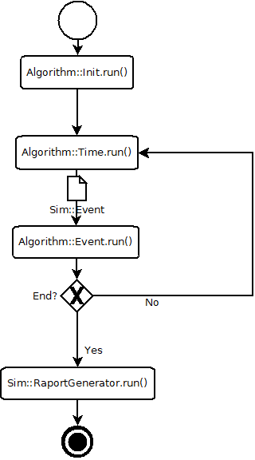

#### Algorytm Inicjujący

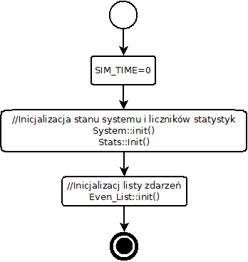

#### Algorytm czasowy

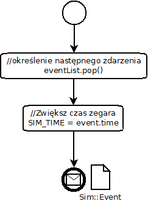

#### Algorytm zdarzeniowy

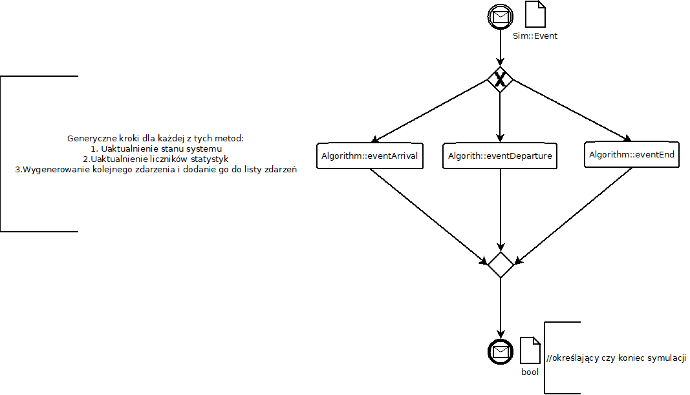

##### ARRIVAL

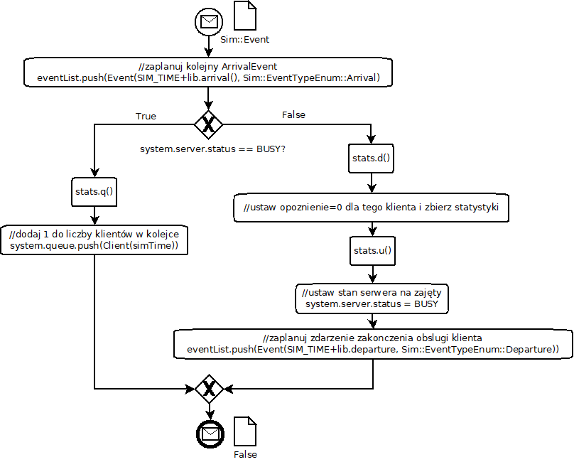

##### DEPARTURE

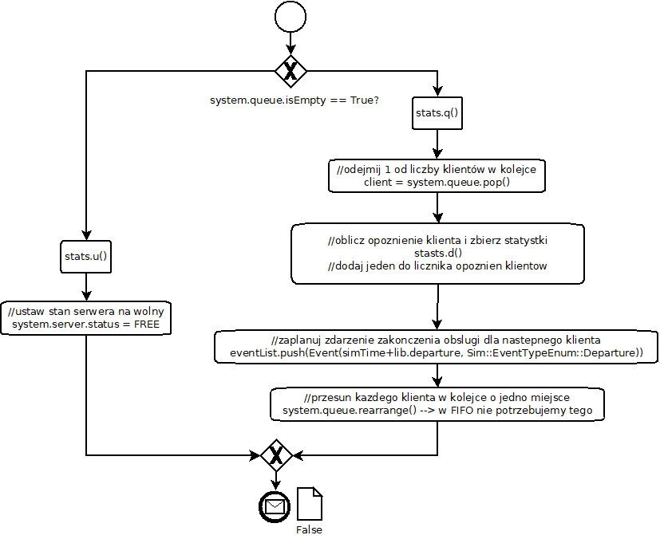

##### END

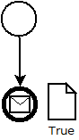

### Implementacja

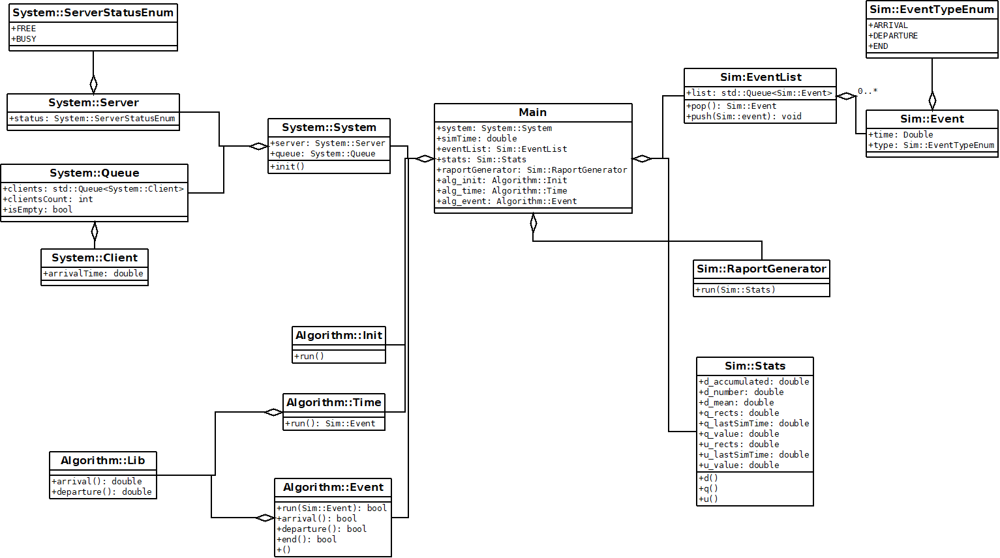

### Zbierane statystki

#### Średni czas oczekiwania w kolejce (d)

`delayAccumulated` - suma czasów oczekiwania klientów od 0 do `i`

`delaysNumber` - liczba czasów oczekiwania

`delayMean` -  średni czas oczekiwania w kolejce klientów

#### Liczba czasów w kolejce oszacowana w czasie ciągłym (q)

#### Wykorzystanie serwera obsługi (u)

### Walidacja poprawności M/M/1

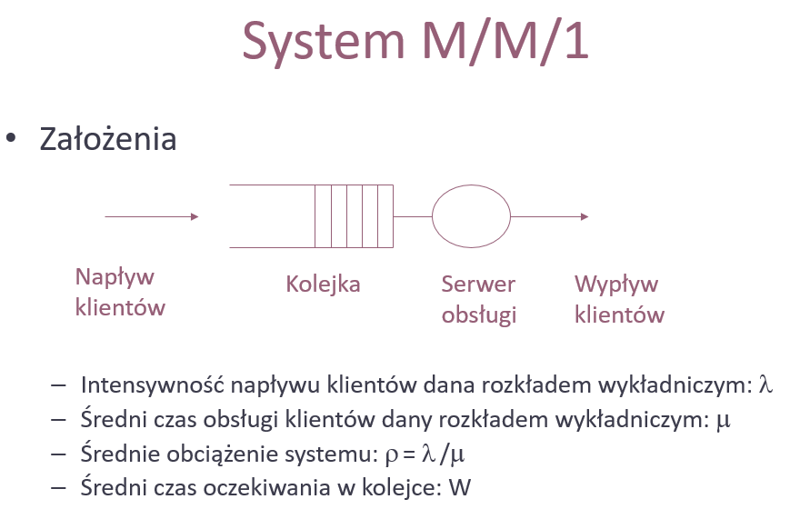

> Przy czym należy pamiętać, że rozkład wykładniczy ma następującą właściwość.
>
> 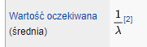
>
> np. gdy ustawimy λ=1/2, to nowi klienci będą się pojawiać się średnio co 2 jednostki czasu

Wartości ` λ` i `μ` przyjmujemy jako parametry wejściowe symulacja. 

Walidacja czy symulacja jest wykonana poprawnie jest sprawdzenie czy wyniki jej doświadczeń zgadzają się z modelem matematycznym. Mówiąc prościej - dla zadanych ` λ` i `μ`, należy sprawdzić poprawność wzorów:

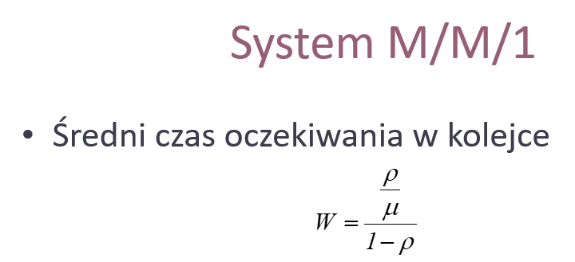

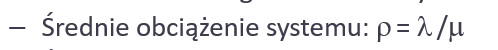

#### Przykład

Parametry wejściowe symulacji:

λ = 1/2

μ = 1

Wyliczone `ρ` i  `W`:

ρ = 1/2

W = 1

Wyniki symulacji:

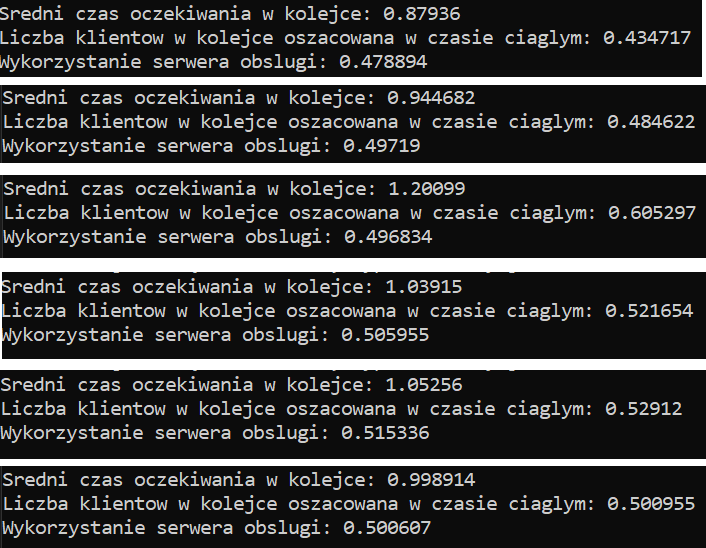

Uzyskane wyniki symulacji pozwalają stwierdzić, że system zaimplementowany jest poprawnie*

W miarę odpalania kolejnych prób symulacji i liczenia wartości średniej z uzyskanych wyników, będzie się ona przybliżać do wartości obliczonych zgodnie z modelem matematycznym. Można też po prostu zwiększyć czas symulacji.

>  *Oczywiście w celu sprawdzenia pełnej poprawności należy powtórzyć przykład dla innych wartość  λ i μ. (ważne przy ich dobieraniu jest to, aby ρ nie wyszło większe od 1 ==> oznaczało by to obciążenie systemu na więcej niż potrafi)

#### Gdzie się zmienia wejściowe parametry?

Wejściowe parametry, czyli:

1/λ - średni odstęp czasowy między klientami napływającymi do systemu

1/μ - średni czasu obsługi klientów przez serwer

Zmienia się w odpowiednio plikach:*

`src/algorithm/LibArrivalExp.h`

`src/algorithm/LibDepartureExp.h`

jako wartość pola `MEAN`

> *od strony programistycznej takie rozwiązanie ssie, ale parametryzacja klasy Algorithm::Events poprzez przyjmowanie obiektów typu Algorithm::ILibArrival, Algorithm::ILibDeparture, którym podawane by były obiekty Algorithm::LibArrival, Algorithm::LibDeparture z odpowiednio ustawionym MEAN w ich konstruktorach, a to z kolei w konstruktorze klasy Program (co programistycznie by było ideałem), utrudniło by zrozumienie systemu.

##### Przykład

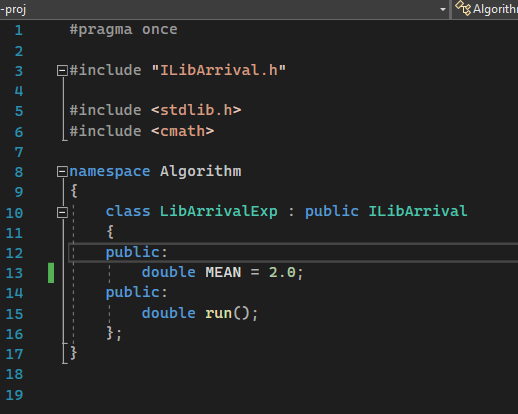

Tutaj λ jest ustawiona na 2.

