# 5 Podstawy testowania

Testowanie ma na celu eksperymentalne określenie możliwości danego systemu (urządzenia bądź sieci), nazywanego **systemem testowanym** - **System Uder Test (SUT)**, dotyczące jego:

- **zgodności (conformance testing)** - polega na sprawdzeniu czy implementacja protokołów i styków jest zgodna ze standardami
- **wydajności/sprawności (performance testing)** - sprawdzenie wydajności SUT
- **możliwości współdziałania (interoperability testing)** - sprawdzenie możliwości współpracy urządzeń pochodzących od różnych dostawców/producentów (ale również urządzeń jednego producenta między sobą)

## 5.1 Testowanie zgodności (Conformance testing)

sprawdzenie, czy funkcje zaimplementowane w SUT są realizowane zgodnie z odpowiednimi zaleceniami, czyli ze standardami.

> Pozytywny wynik testów zgodności nie gwarantuje pełnej i poprawnej pracy badanego urządzenia w sieci. Konieczne jest zatem budowanie sieci pilotowych, w których można dokładnie zbadać działanie sprzętu; w praktyce mogą zdarzyć się sytuacje, kiedy dwie zgodne implementacje po prostu nie współpracują ze sobą.

### PICS (Protocol Implementation Conformance Statement)

Przeprowadzenie testów zgodności wymaga wiedzy o funkcjach realizowanych przez SUT. Informacje te zawarte są w dokumencie **„Oświadczeniu o zgodności implementacji protokołu ze specyfikacją” – PICS (Protocol Implementation Conformance Statement) **

PICS zawiera listę pyta dotyczących każdej funkcji ze standardu. Odpowiedziami może być TAK/NIE lub wartość parametru (ew. jego zakres).

Dokument PICS robi producent na podstawie ***wzoru* (PICS proforma)** otrzymanego od organizacji standaryzującej dany protokół.

> Przykładowy PICS proforma
>
> 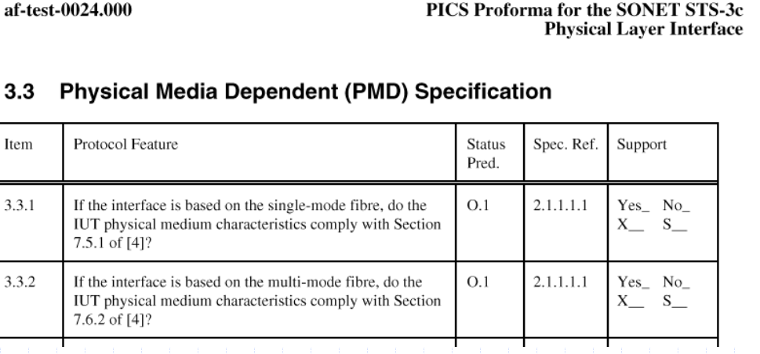

Warto powiedzieć, że w każdym standardzie tych obowiązkowych funkcji to jest tak z 1/3. Reszta to są opcjonalne rzeczy. Producenci nie chcą, żeby wszystko było wspólne. Producent, żeby wyróżnić się na rynku oprócz jakiś standardowych funkcji protokołu dodaje też swoje, których NIKT INNY NIE MA

### TTCN (Tree and Tabular Combined Notation)

Zestawy testów podlegają standaryzacji i są zapisywane w notacji TTCN (ang. Tree and Tabular Combined Notation) ITU-T X.292).

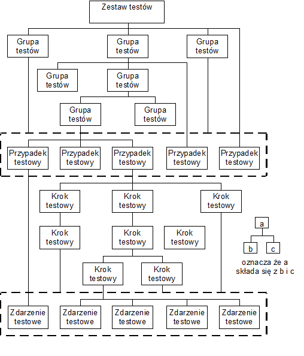

Elementy specyfikacji testów:

- Zestaw testów (root element)
- Grupa testów (agreguje, hierarchizuje)
- Przypadek testowy (opisuje jakiś przypadek, warunki początkowe)
- Krok testowy (zbiór zdarzeń lub kroków)
- Zdarzenie testowe (np. odebranie lub wysłanie pakietu)

### Konfiguracja testowa

Ogólna wygląda tak:

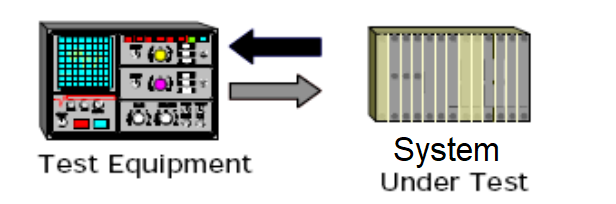

> Oprócz ` System Under Test ` spotykane tez jest określenie `Implementation Under Test`. Odnosi się, że jakiś system implementuje jakiś standard, i my w testach zgodności badamy właśnie implementacje tegóż standardu.

### Procedura testowa

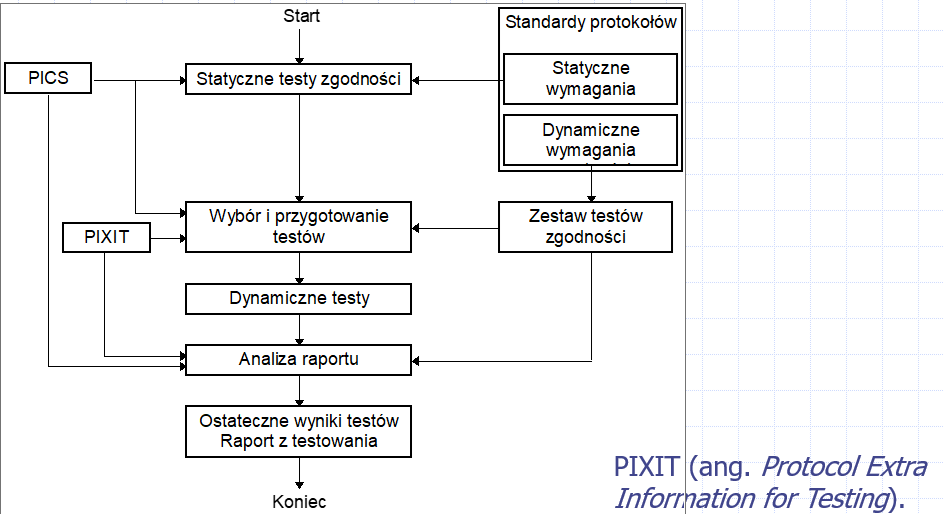

Testy tak btw dzielimy na dwie grupy:

- **statyczne**
  - Otrzymujemy do przetestowania jakiś SUT, bierzemy PICS od producenta tego urządzenia i manualnie patrzymy jakie implementuje funkcje i porównujemy do tego co jest w zaleceniu/standardzie
- **dynamiczne**
  - Wkładamy SUT do jakiegoś testowego środowiska, np. ruter i wtedy jakimś generatorem wysyłamy multum wiadomości między ruterami i patrzymy czy się nie wywala coś, czy dobrze działa

No więc jaki widać w pierwszym kroku robimy testy statyczne. Czyli bierzemy PICS i Standard i porównujemy.

Drugi krok to wybór i przygotowanie testów dynamicznych. Wtedy patrzymy również na dokument PIXIT oraz na zestaw testów zgodności zalecany przez organizacje standaryzujące dany protokół.

**PIXIT** - Dodatkowe informacje o testowaniu danego urządzenia od producenta są w dokumencie **Protocol Extra Information for Testing**

Trzeci krok to analiza tego co testy dynamiczne przyniosą. Sprawdzamy czy producent nie kłamie w PICS co do swoich funkcji

### Ocena wyników i werdykt

Są 3 możliwe oceny czy spełnione jest dane wymaganie.

- **Pass ** - Wyniki testu świadczą o spełnieniu określonego wymagania zgodności ze standardem
- **Fail** -  Wyniki testu świadczą o NIEspełnieniu określonego wymagania zgodności ze standardem
- **Inconclusive** - testu nie pozwalają w sposób jednoznaczny określić, czy dany test zakończył się powodzeniem bądź niepowodzeniem

Raport zawiera wyniki wszystkich testów

**Werdykt**

Systemem uznajemy za zgodny jeśli spełnia wszystkie obowiązkowe wymagania zgodności wyspecyfikowane w oświadczeniu PICS proforma.

### O co chodzi ze standaryzowaniem

Sprzęty od różnych producentów powinny działać ze sobą, dlatego potrzebne są standardy. Z drugiej strony jak wiadomo to też jest rynek, na którym każdy producent chce zarobić. 

Dlatego firmom często ciężko się dogadać, czasem trwa to latami. Producenci też dodają do przyjętego standardu jakieś swoje funkcje, których nie mają inni, żeby móc je opatentować, po to by inni się dopasowali i/lub płacili im za wykorzystanie czegoś u siebie.

> Dlatego często mamy w protokołach jakieś puste pola, gdzie producenci mogą dodawać swoje ficzery.

Oczywiście trzeba też się dogadać na jakąś część wspólną. IETF to zrzeszenie firm, które wspólnie sobie standaryzują.

Testowanie zgodności to niedopuszczenie do takich sytuacji, że kod 0x23 w wiadomości rutera od producenta X oznacza A, a w ruterze od prod. Y oznacza coś innego, bo to prowadzi do błędów. 

Ta sama grupa, która standaryzuje jakiś protokół również opisuje jakie oraz jak wykonać testy zgodności. Opisuje to za pomocą dokumentów PICS proforma oraz TTCN.

> Jak np. Nokia robi telefon to najpierw zamyka go w klatce Farradaya i puszczają mu tam wszystkie wiadomości przez kilka dni bombardując go falami elektromagnetycznymi i jak wszystko git to dopiero wypuszczają na rynek.
> Aczkolwiek w celu cięcia kosztów odchodzi się od tego i testuje dopiero na userach końcowych. Tzn. nie tesuje się w pełni, a to co zostało nieprzetestowane okaże się po releasie i userzy sami zgłoszą (też często ciężko naklikać coś jako człowiek techniczny w ten sam sposób co głupi user). Wtedy userowi wymienia się telefon na nowy i to i tak jest taniej niż dokładne testy. Testerzy często testują tylko happy pathy i nawet nie są w stanie sobie wyobrażić co te user naklika.

### Organizacje testujące

Powstają one głównie dlatego, że producenci często oszukują, że nowe funkcje u nich są. Najpierw tłumaczą się, że nie ma, bo źle się sprzętu używa, potem okazuje się, że mają to na roadmapie i niedługo będzie albo ze trzeba zrobić aktualizacje. Producenci tak kłamią z racji, że po prostu technologia i te nowe rzeczy pojawiają się mega szybko.

Z racji tych kłamstewek dopiero gdy przetestujemy daną funkcję, wiemy czy ona w danym urządzeniu jest czy nie. Dlatego testy są ważne, a najlepiej jak ktoś te testy zrobi za nas, zanim jeszcze coś kupimy. Stąd wzięło się zapotrzebowanie na organizacje testujące.

Organizacje testujące wystawiają certyfikaty treści "My twierdzimy, że urządzenie X jest zgodne ze standardem A"

###  Ciekawostki

> Google teraz robi tak, że wszystko co wymyślą sobie wewnętrznie robią open-source, przez co te rzeczy stają się powszechne. A google potem sobie wymyśla jak na tej powszechności czegoś zarobić.

> W wifi producenci tak bardzo nie mogli się dogadać ze standardem, że trwało to 15 lat. W rezultacie rutery miały np. naklejki "QoS ready", bo implementowały te kolejki, ale nie było na to jednolitego standardu. Czyli urządzenia implementowały coś, co jeszcze nie było zestandaryzowane.

## 5.2 Testowanie wydajności/sprawności (Performance testing)

Testowanie sprawności SUT dotyczy pomiarów parametrów związanych z:

- Wydajnością urządzenia

  - np. maksymalna liczba przesyłanych pakietów na sekundę

- Oferowanej jakości usług

  - poziom strat, poziom opóźnień, zmienność opóźnienia itp.

- Wydajność systemu sterowania SUT

  - liczba przetwarzanych wiadomości sygnalizacyjnych, dopuszczalna wielkość tablic rutingu

  - > chodzi o to, że ruter moze być wydajny w user plane, ale sygnalizacja moze nie nadążać.

w warunkach danego obciążenia systemu, np. w możliwe najgorszym przypadku (**worst case analysis**)

**Sprawność vs. Wydajność**

Wydajność to ile fabryka dała, a sprawność określa jak daleko jesteśmy od wydajności w sensownych warunkach

### Worst Case Analysis

Nie trzeba testować SUT we wszystkich możliwych warunkach, ale w takich, które pozwalają o SUT coś powiedzieć. Dlatego często testuje się SUT w takich warunkach, które są sensowne oraz najgorsze. Jeżeli w najgorszych sensownych (takie które mogą zaistnieć) warunkach spełniamy jakieś np. opóźnienie to zakładamy, że w lepszych warunkach również je spełnimy.

### Konfiguracja testowa

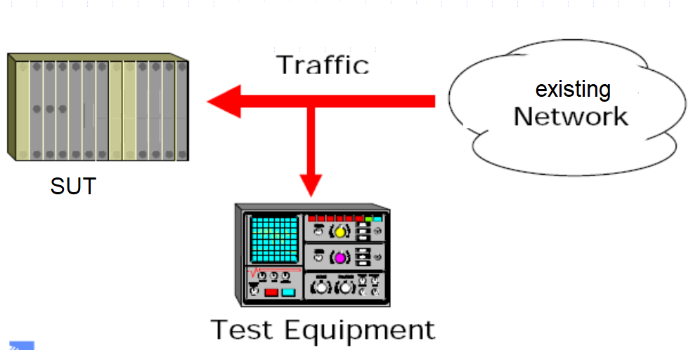

Mamy jedno połączenie, które testujemy, a **load generator** ma przeszkadzać.

Load generator nie ma na celu tworzyć 100 połączeń, bo to bez sensu lepiej wygenerować **ruch poissona** (czyli taki gdzie w danej chwili liczba pakietów do obsłużenia jest losowa, gdyż odzwierciedla on prawdziwe warunki w sieci. Ale czy takie warunki to rzeczywiście najgorszy przypadek?

Dlatego często podłącza się SUT oraz Sprzęt testujący SUT do prawdziwej sieci i czekamy aż tam wystąpi mega obciążenie.

### Procedura testowa

Testowanie sprawności jest bardzo złożone, zależne od celu testu.

W ogólności nie podlega standaryzacji. Nie ma przepisu. Testy wydajności to szutka testowania.

> W odróżnieniu od testów zgodności nie da się ujednolicić, zdefiniować konwencje. Jak chcesz sprawdzić sprawności Internetu? Są różne profile klienckie, różnie obciążające sieć. Np SUT może wypaść dobrze w ruchu HTTP, a słabo w UDP.
>
> Inne testy robi się w sieci szkieletowej (która głównie tranzytuje ruch), a inne w sieci brzegowej (która realizuje funkcje klienckie takie jak NAT).

### RFC 2544

Nie ma standardu jak test przeprowadzić, ale RFC 2544 definiuje "standardowy" zestaw testów sprawności dla urządzeń IP.

Obejmuje on testy:

- Throughput
- Latency
- Frame loss rate
- Back-to-back frames
- System recovery
- Reset

> Tak btw. to IP było projektowane, tak że będzie działać na urządzeniach niezawodnych.

#### Throughput

Is the fastest rate at which DUT transfers frames without losses. Czyli maksymalna przepustowość, gdzie nie ma strat.

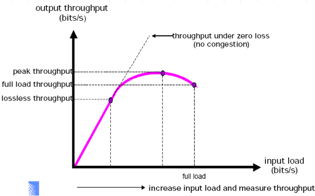

Na osi X zwiększamy ruch obiążąjący **DUT (Device Under Test)**. Na osi Y widzimy szybkość z jaką DUT obsługuje **load**.

Widać, że w okolicach 70% urządzenie przestaje wyrabiać. DUT procesuje jakiś pakiet a przychodzi następny i nadpisuje tamten i wtedy DUT się gubi jest w stanie mniej procesować, dlatego throughput spada.

Do 70% mamy nachylenie prostej 45 stopni, czyli tyle ile pakietów przychodzi, tyle wychodzi.

Gdyby oś X odwrócić czyli najpierw DUTowi dajemy dużo pakietów do obłsugi, a potem coraz mniej to ten wykres nie jest odbity symetrycznie. Nie wraca po tej samej krzywej tylko powstaje histereza na jakiś czas i dopiero potem wracamy do 45 stopni. Dzieję się tak, bo ruter próbuje się wygrzebać ze stanu przeciążenia

> Dlatego ważne są mechanizmy zabezpieczanie przeciw przeciążeniom oraz mechanizmy wygrzebywania się z nich. Nie chcemy histerezy, bo wtedy mamy nieco stan nieoznaczoności. Jedną z technik co zapobiega przeciążeniu jest odrzucanie pakietów, gdy jesteśmy jego blisko.

**Procedura mierzenia**

Send a specific number of frames at a specific rate through the DUT and then count the frames that are transmitted by the  DUT. If the count of offered frames is equal to the count of received frames, the fewer frames are received than were transmitted, the rate of the offered stream is reduced and the test is rerun.

#### Latency

The time interval starting when the last bit of the input frame reaches the input port and ending when the first bit of the output frame is seen on the        output port. 

Latency to nie delay. Latency mówi o tym jakie opóźnienie wprowadza pojedyncze opóżnienie (nie uwzględnia stanu sieci i szybkości łączy jak delay).

Dąży się do tego, żeby latency nie było zależne od długości pakietu.

Latency to czas od momentu wejścia pakietu do DUT, do momentu wyjścia z DUT.

**Na co składa się czas latency?**

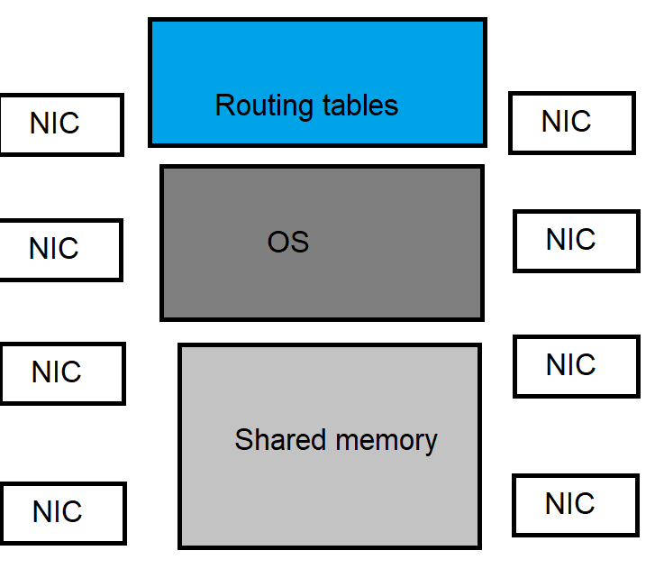

Najpierw pakiet trafia do NIC (Network Interface Card), ona nalicza sume kontrolną i jak git, to pakiet trafia do pamięci wspólnej a NIC robi przerwanie sytemowe do OS. OS bierze pakiet z pamięci wspólnej, patrzy w tablice routingu (to długo zajmuje), a w tym czasie pakiet sobie spokojnie siedzi w pamieci wspólnej. OS ustawia odpowiednie wskaźniki i kończy pracę z pakietem. Pakiet jest przekazywany na odpowiedni NIC i tam trafia do kolejki skąd jest wysyłany dalej.

#### Frame loss rate

To determine the frame loss rate of DUT throughout the entire range of input data rates and frame sizes

**Procedura pomiarowa**

Send a specific number of frames at a specific rate through the DUT to be tested and count the frames that are transmitted by the DUT

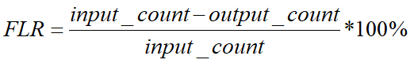

Głownie te straty ramek nie wynikają z przepełnienia buforów tylko z tego ze gdzieś albo hardware nie zadziałał (tranzystor przeskoczył) albo OS coś źle sprawdził w tablice i nie umie.

> W NFV gdzie mamy zwielokrotnienie może dochodzić do hazardu pomiędzy kontenerami na etapie odwielokrotnienia i są wyścigi, które ktoś może przegrać.

#### Back-to-Back Frames

To characterize the ability of DUT to process back-to- back frames. Back to back, to ze ramki stykają. Że na końcu jednej już jest kolejna.

**Procedura pomiarowa**

Send a burst of frames with minimum inter-frame gaps to the DUT and count the number of frames forwarded by the DUT. 

- If no losses increase the length of the burst

- If losses decrease bursts length

Wysyłamy pakiet jeden za drugim, bo to co innego niż jak istnieje jakiś odstęp czasowy między ramkami podczas którego ruter ma czas je procesować.

#### System recovery

To characterize the speed at which DUT recovers from an overload conditions

Określa szybkość z jaką ruter radzi sobie z przeciążeniami. Czyli od momentu wystąpienia przeciążęnia, do memntu poradzenia sobie z nim i wróceniu do normalnego stanu.

Czyli jaki jest czas od zawału DUT do odzyskania sprawności. Test mechanizmy anty-przeciążeniowego.

**Procedura pomiarowa**

- Measure throughput

- Load the system up to 110% of throughput or to maximum load for at least 60s

- Reduce the frame rate to 50%

- Measure the time interval between reducing rate event and the last lost packet

#### System reset

To characterize the speed at which a DUT recovers from a device or software reset.

Czyli ile czasu minie od naciśnięcia przycisku reset do ponownego stanu gdzie ruter może sprawnie procesowac pakiety.

**Procedura pomiarowa**

- Send a continuous stream of frames at the determined throughput rate for the minimum sized frames

- Cause DUT reset (hardware, software reboot, power loss)

- Measure the time interval between reset event and the event when frames will be again forwarded

## 5.3 Testowanie współdziania (Interoperability testing)

Zadaniem testów współpracy jest zbadanie możliwości współpracy dwóch urządzeń, systemów lub protokołów.  

Testujemy zazwyczaj czy urządzenia od różnych producentów działają ze sobą. Ale może też być tak, że urządzenia tego samego producenta ze sobą nie współpracują, więc to też podlega testom.

Testowane urządzenia powinny przejść pozytywnie testy zgodności

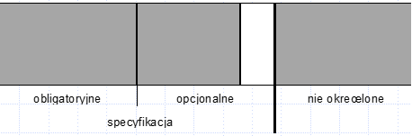

Należy pamiętać, że specyfikacja standardu określa, że tylko część (ok. 1/2) funkcji są wymagane (obligatory). Reszta jest opcjonalna. Dodatkowo producenci, żeby się wyróżnić dodają swoje funkcje, które w ogóle nie są określone w specyfikacji standardu.

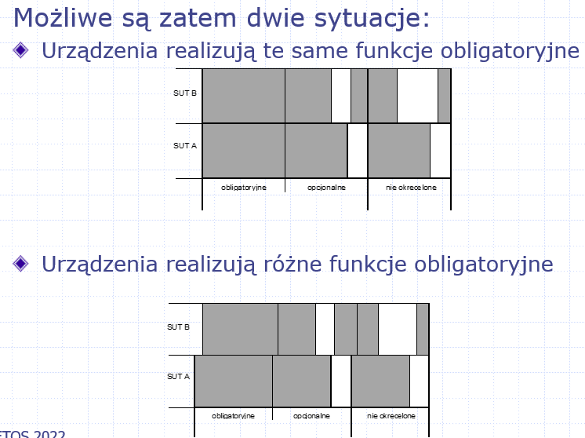

Może się tak zdarzyć, że nawet funkcje obligatoryjne się w pełni nie zgadzają.

### Procedura

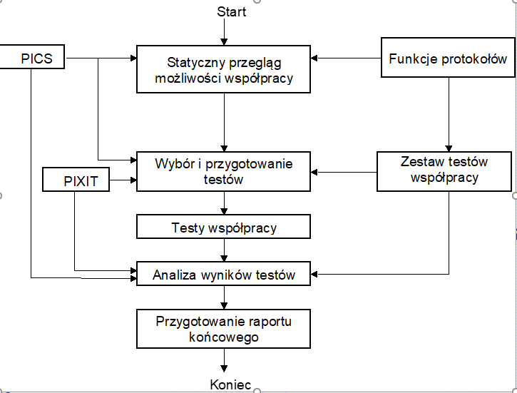

Testy współpracy dzielimy na:

- **Statyczne** - porównywanie wyników testów zgodności i sprawdzenie co w urządzeniach się pokrywa (część wspólna)
- **Dynamiczne** - praktyczna weryfikacja współpracy. W ramach testów współpracujące urządzenia są pobudzane sygnałami testowymi i sprawdzana jest zarówno odpowiedź jak i poprawność interakcji pomiędzy urządzeniami testowymi

W dynamicznych po prostu łączymy urządzenia ze sobą i patrzymy czy to bangla.

### Konfiguracja

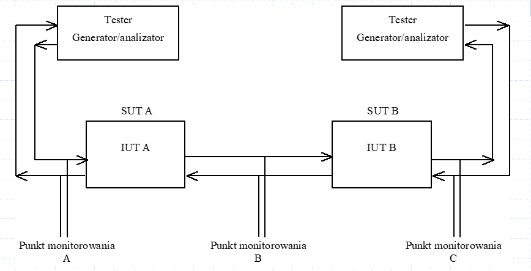

## 5.4 Przeprowadzanie testów

Jak prawidłowo wykonać test.

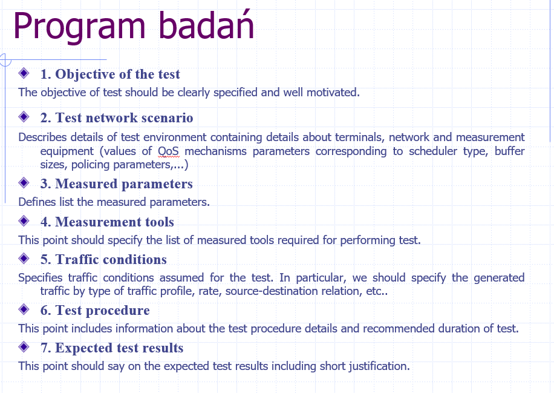

# 6 Symulacja zdarzeniowa

## 6.1 Wstęp

Symulacja jest jedną z trzech głównych metod naukowo-badawczych dla badania systemów

Pozostałe dwie to:

- programowanie matematyczne
  - np. liniowe lub nieliniowe
- statystyka

Jedną z umiejętności, którą powinien wykazać się absolwent studiów inżynierskich to umiejętność zastosowania technik symulacji do badania systemów

### Symulacja

Technika numeryczna, która pozwala na przeprowadzaenie za pomocą komputera pewnego doświadczenie badawczego

Symulacja służy ocenie działania badanego **systemu**, dlatego podczas symulacji gromadzone są dane w celu oszacowania charakterystyk opisujących badany system

### System

Pewien zbiór elementów, które działają lub współdziałającyhc wzajemnie, aby osiągnąć pewne logiczne zakończenie działania

w celu przeprowadzania badania symulacyjnego opisujemy system najczęściej za pomocą matematycznych lub logicznych powiązań

Opis systemu stanowi **model**, który jest używany do próby zrozumienia działania systemu

> System - elementy i ich powiazania. A jak system przedstawiamy jakimś opisem to **model**. Z tym, że **model symulacyjny** nie musi mieć wszystkich aspektów tego systemu, ale tylko te które są potrzebne do badania systemu pod naszym kątem.
>
> np. nie musimy mieć procesów routingu tylko wpisujemy ścieżkę na sztywno, no bo jeśli badamy na poziomie nanosekund, a takie wpisywanie ścieżek dzieje się co godzinne to to nie ma wpływu.
>
> Dlatego model systemu jego odpowiednie przygotowanie powinno być zrobione starannie i dużo czasu poświęcić. Trzeba właściwie zdecydować co jest istotne a co nie. Sztuka podjęcia decyzji co wyeliminować.

### Model

Przyjęty model powinien umożliwić realizację celu danego badania systemu

Jest to zbiór elementów systemu, ich atrybutów/zachowań oraz procesów zachodzących na elementach, które to procesy wywołują zmiany **stanu systemu**

> To co modelujemy powinniśmy zamodelować jak najmocniej, a to co jest dookoła potraktować jako czarną skrzynkę ze świadomością co tam jest.
>
> Czasami system, który modelujemy jeszcze nie istnieje, bo go dopiero tworzymy

> Mamy system i chcemy zobaczyć jak radzi sobie w róznych ruchach. Nie potrzebujemy do tego 1000osób, tylko mozemy je zamodelować.
>
> Ważne jest też to co się składa na to co chcemy zbadać, jeśli chcemy zbadać opóźnienia to możemy zbadać tylko kolejki w tym systemie.
>
> Np. mamy 4 węzły to nas nie interesuje ze tam jest jakis system zarządzania na kazdym węźle, tylko kolejki na wyjściowych interfejsach ruterów brzegowych. Więc tylko dwie kolejki, napływ i wypływ. A to ze co tydzień zmienia się tablica rutingu w systemach zarządzania to nas nie obchodzi z punktu widzeni połączenia VoIP
>
> Czyli to modelowanie pozwala zrobic ze nie musimy mieć całej rzeczywistości tylko kawałek a reszte modelować.
>
> Jak np. sa testy mobilności w 5G to trzeba by mieć samochód i jezdzic po wawie, a jak moge dobrze to zamodelować to odchodzi mega duzo kosztów.
>
> Babka mówi, że systemy telekomunikacyjne to systemy kolejkowe.
>
> Bez symulacji nie przetestujemy systemów ktorych jeszcze nie ma.

### Stan systemu

Zbiór zmiennych koniecznych do opisania systemu w danej chwili czasowej

Zmienne opisujące system są odpowiednie dla założonego celu badania

> stan systemu to co jest potrzebne do przystapienia do symulacji
>
> > np. jak badam sygnalizacje to nie musze uwzgledniac opoznien na polaczeniach, no bo mimo ze wiadomosci sygnalizacyjne sa przenoszone pakietami to i tak to nie jest istotne.
> >
> > W sylwestrze system sygnalizacyjny cały czas działa ale jest tak zapchanie ze nikt nie jest obsługiwany, dlatego ważne jest zeby określić ze w najgorszym przypadku obsługiwane  jest tyle i tyle userów. Określamy sygnalizacyjnie godziny największego ruchu, np. w nocy mało, ale juz w data plane gdzie są przekazywane dane z całego świata to nie da się tak przewidzieć (no teraz to się zmienia bo serwery są coraz bliżej brzegu).
>
> > Internet ma 50 lat. Ale ma takie kanony jak IP i TCP i one sa mimo SND i NFV itp. bez wątpienia to się złamie, były juz prace post-IP al still na tym sie opieramy. Wiemy ze zmiany są niezbędne. Lotniska cały czas mają ATM i UMTS.

### Dyskretne vs Ciągłe

Systemy można podzielić na dykretne i ciągle

W **dyskretnym** *stan systemu* zmienia się tylko w pewnych chwilach czasowych np. liczba pakietów w ruterze, zmienia się tylko, gdy pakiet przyjdzie do rutera, lub kiedy po obłsudze opuści ruter

W **ciągłym** *stan systemu* zmienia się w sposób ciągły w czasie np. samolot lecący w powietrzu, gdyż pozycja zmienia sie non-stop

> to ze system jest ciągły nie znaczy ze mozemy go modelować w sposób dyskretny i vice versa

Cześć systemów możemy zakwalifikować jako tylko dyskretne, cześć jako tylko ciągłe, ale pewne można modelować zarówno jako ciągłe jak i dyskretne w zależności od celu badania

> z ogółu modelujemy system tele jako dyskretne bo sam w swojej naturze jest dyskretny

>w systemie ciągłym zmiany są cały czas w czasie np. leci samolot, co nie zmienia faktu ze mozesz go zamodelować w sposób dyskretny, bo pewne rzeczy dzieją się dyskretnie, zależy co chcemy modelować. np. siec w samolocie z racji ze jest dyskretny to modelujemy dyskretnie

## 6.2 Sposoby badania systemów

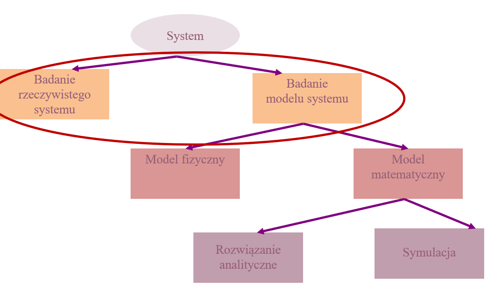

> W tele systemy musza byc globalne wiec ta skala jest ogromna. Mamy jedno urzadzenie ale musimy patrzec jak on sie zachowuje w wielkiej sieci.
>
> Model fizyczny no to na zasadzie buduje elementy, jakies urzadzenia, a model matematyczny to taka pierwsza podstawa np. modele kolejkowe.
>
> Są dwa matematyczne albo analityczne albo wynik symulacji. najlepiej jak mamy system ktory da sie opisac matematycznie, to wtedy analiza. Jak mamy rozkład possiona czy cos to wszystko daje sie zrobic ale jak mamy cos bardziej zlozonego to nie zawsze daje sie analitycznie, mozemy robic aproksyacje, jakies uproszczenia to warto zweryfikowac jak blisko jestesmy rzeczywistoci poprzez symulacje
>
> bardzo wazna odnoga jest experimentally driven research, zeby od poczatku systemu expretymujemy kolejne rozwiazania dla niego

## 6.3 Obszary zastosowania

Obszary zastosowania metody symulacyjnych w telekomie:

- projektowanie sieci teleinformatycznych
  - Projektowanie algorytmów i mechanizmów
  - Weryfikacja i walidacja protokołów tele
  - Modelowanie ruchu w sieci
  - badanie niezawodności, optymalnej alokacji zasobów w sieci itp.
- Projektowanie metod przetwarzania sygnałów (modulacje, odporność na błędy, kodeki mowy itp.)
- Badania efektywności projektowania układów
- Symulacja modeli biznesowych
- Odporność systemów transmisyjnych na błędy, sychronizacja systemów

Przykłady zastosowania symulacji dla wielousługowych sieci NGN:

- poprawność działania
  - protokołów, mechanizmów
- ocena efektywności
  -  protokołów, mechanizmów
- skalowalność
  - architektur sieciowych, implementacji elementów architektury

Metody dla oceny efektywności usług sieciowych

- Ocena jakości przekazu pakietów przez sieć
  - Parametry jakości: opóźnienia, zmienność opóźnienia, straty pakietów w sieci

- Ocena efektywności poszczególnych mechanizmów QoS dla zapewnienia jakości przekazu

Metody dla oceny efektywności sygnalizacji na poziomie wywołań

- Parametry: czas zestawienia połączenia, czas rozłączenia
- Identyfikacja elementów systemu, które mają istotny wpływ na czas zestawienia bądź rozłączenia połączenia

Metody dla oceny efektywności poszczególnych

- protokołów sygnalizacyjnych, elementów zarządzania zasobami, procesu zestawiania połączenia

Skalowalność systemu sygnalizacji na poziomie wywołań

- Ocena możliwości rozbudowy systemu dla założonych wartości parametrów efektywności sygnalizacji 
- Ocena możliwości rozbudowy systemu np. w sensie zwiększenia liczby użytkowników, usług, domen, itp.

## 6.4 Wady

Modele systemów złożonych są często też złożone (np. model sieci rozległej)

- napisanie programu komputerowego dla celów symulacji bardzo złożonych systemów jest trudne
  - w ostatnich latach stało się to łatwiejsze dzięki tworzeniu nowych języków dla potrzeb symulacji tzw. języków wysokiego poziomu oraz dzięki stworzeniu specjalistycznych pakietów symulacyjnych
- złożonym zagadnieniem jest również zbieranie i analiza danych
- po badaniach symulacyjnych i tak niezbędna jest weryfikacja praktyczna np. w formie systemów prototypowych

"zasymulować można wszystko, nawet to czego nie ma" - wiec jak nas fantazja poniesie to zasymulujemy nieprawde, dlatego zawsze wynik symulacji to aproksymacja rzeczywsitego systemu

## 6.5 Mechanizmy sterowania w sieci

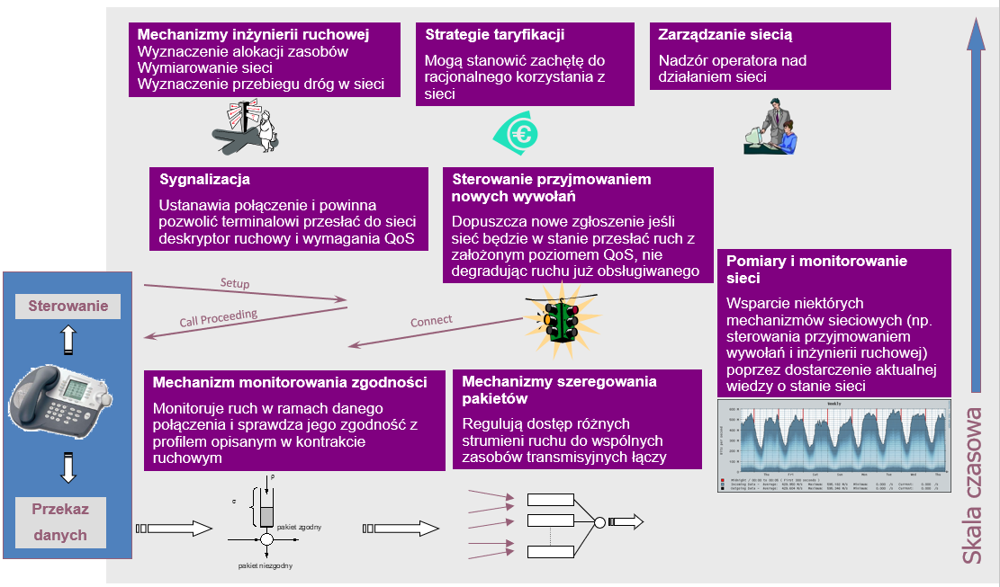

## 6.6 Dostępne pakiety symulacyjne

Badanie poprawność działania systemów, protkołów

- narzędzia symylacyjne TAU
- UML
- pakiet komercyjny

### RIVERBED

C++

komercyjny

- umożliwia symulacje wszystkich znanych technik sieciowych (przewo i bez), protokołów
- modele symulacyjne stanowią BARDZO dokładne odwzorowanie badanych systemów
- możliwość oprogramowania własnych modeli symulacyjnych

pakiet akademicki

- symulacja podstawowych systemów kolejkowych, wybranych protokołów i technik sieciowych
- brak możliwości oprogramowania własnych modeli symulacyjnych

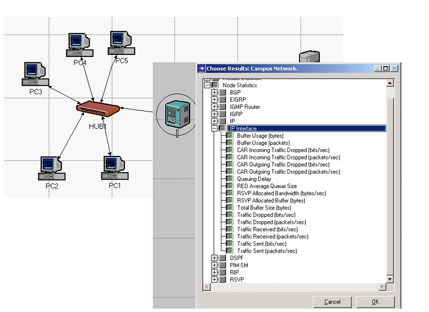

### ns-2, ns-3

pakiety symulacyjne finansowane przez DARPA

dostępne modele symulacyjne

- poziom pakietów
- warstwa transportowa i aplikacji
- sieci bez i przewodowe

napsiany w C++ i OTcl

TCL = Command Tool Language (język skryptowy)

bezpłatny

### Breaking point

firma IXIA

do symulacji ataków DoS i DDoS

pozwala na ocene systemów antyDos i antyDDoS

### zastosowania ns-2 w projekcie EuQos

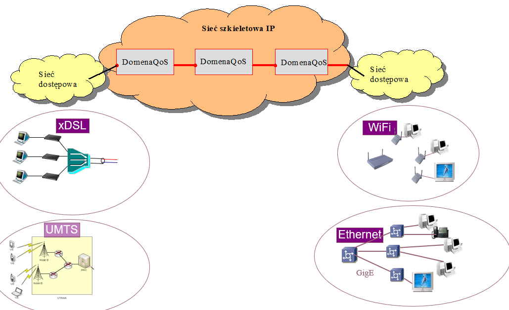

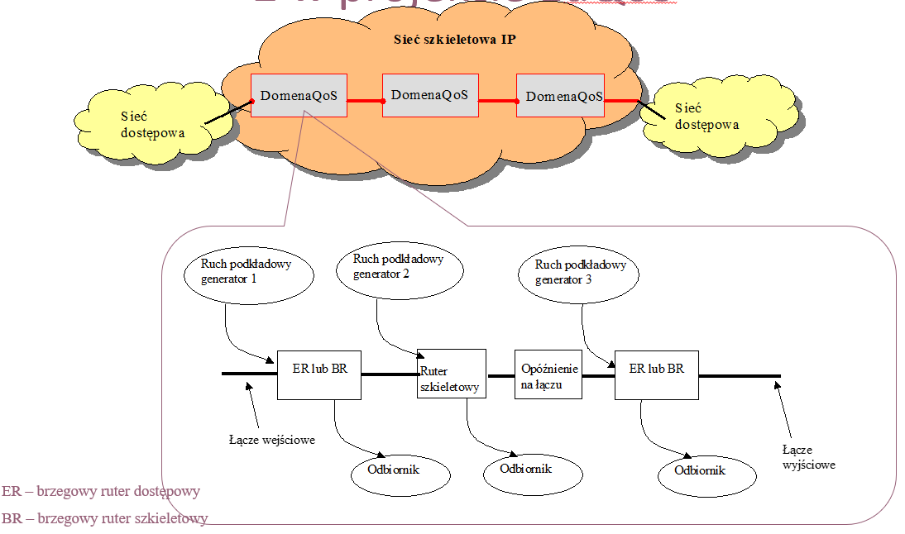

# 7 Tworzenie modeli symulacyjnych

- modele symulacyjne
- symulacja zdarzen
- podstawowe moduly modelu symulacyjneo
- tworzenie listy zdarzen

## 7.1 Modele symulacyjne

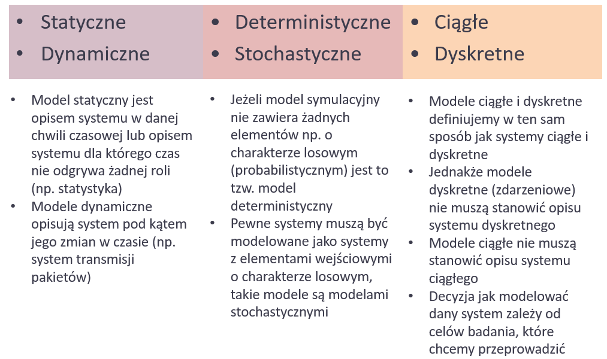

statyczny - nie ma zmian w czasie, opis sytemu nie zależy od czasu, który płynie

dynamiczny - opisujemy model pod katem co sie dzieje w systemie w czasie, zmiany systemu w czasie (np. są zdarzenia) kolejki pakietow ze przychodzi pakiet

deterministyczny - w okreslonych chwilach czasowych w systemie są określone zmiany (np. pakiety przychodzą równo co x ms)

stochastyczny - z pewnym p-stwem zachodza jakies zmiany w systemie (np. pakiet przychodzi co x ms z takim pstwem, a co x+1 z innym pstwem)

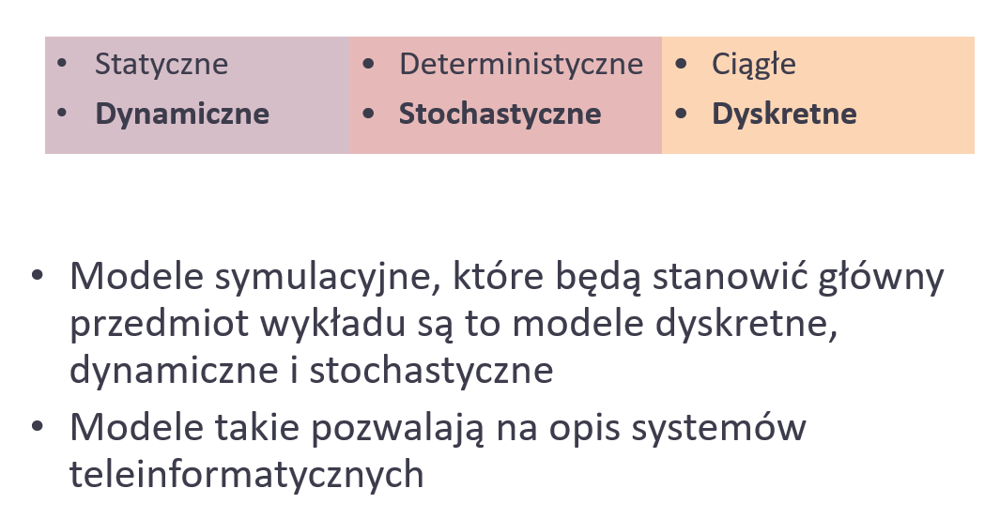

Większość systemów kolejkowych jest opisywania za pomocą modeli stochastycznych

Stochastyczne modele symulacyjne pozwalają na otrzymanie wyników o charakterze losowym. Dlatego muszą być rozpatrywane jako oszacowanie (estymacja) rzeczywistych charakterystyk. Jest to jedna z podstawowych wad badania systemu za pomocą symulacji

## 7.2 Symulacja zdarzeń

Dotyczy ona modeliwania systemów, których stan zmienia się w pewnych chwilach czasowych. Z matematycznego punktu widzenia możemy powiedzieć, że *stan systemu* może ulegać zmianie w policzalnej liczbie chwil czasowych. Te chwile czasowe są chwilami, w których mają miejsce pewne **zdarzenia**

**Zdarzenie** - chwilowe działanie, które MOŻE spowodować zmianę *stanu systemu*

> musimy okreslic ile ta symulacja będzie trwała 
>
> jak mamy rozkład poissona a mamy za krótką symulacje, to tak jakby ten poisson nie "uaktywni się"

### Przykład

Temat: system obsługi w punkcie informacyjnym na lotnisku

Cel: oszacowanie spodziewanego średniego czasu oczekiwania w kolejce do obsługi przez przybywające klienta

Stan systemu:

- `stan serwera`: zajęty lub wolny
  - konieczny do podjęcia decyzji, czy przybywający klient może przejść natychmiast do obsługi, czy musi poczekać
- l`iczba klientów w kolejce`
  - po zakończeniu obsługi klienta przez serwera, pozwala stwierdzić czy serwer przechodzi w stan zajęty czy wolny
- `czas przybycia każdej osoby, która oczekuje na obsługę`
  - do obliczenia czasu oczekiwania na obsługę

Zdarzenia:

- Przybycie klienta
  - powoduje zmianę zmiennych stanu systemu
    - albo zmiana `stanu serwera` z wolny na zajęty
    - albo zwiększenie `liczby klientów w kolejce`
- Zakończenie obsługi klienta przez serwer
  - zmiana `stanu serwera` z zajęty na wolny

Uwaga - zdarzenie może powodować zmianę stanu systemu, ale nie musi. Np. zdanie zakończenia symulacji nie zmienia stanu systemu

> mozemy tez robic zdarzenie przechodzenie klienta z kolejki do stanowiska, ale mozemy to tez wliczyc w czas obslugi, zeby zredukowac liczbe zdarzen
>
> Arrival -> Que -> Server -> Departure

> w modelach kolejkowych mamy albo kolejki skonczone albo nieskonczone
>
> jesli mamy tylko kolejke to klient przybywa do kolejki, ale jak mamy wiecej kolejek (elementow) to przychodzi do systemu

### Mechanizm zwiększania czasu

Dwa podejścia:

- zwiększenie **czasu zegara symulacji** spowodowane wystąpieniem kolejnego zdarzenia
- zwiększenie  **czasu zegara symulacji** w stałych odstępach

Pierwsze podejście jest powszechnie stosowane, a drugie traktowane jako szczególny przypadek pierwszego

W pierwszym podejściu przedziały czasowe, w których nie występują zdarzenia są "przeskakiwane" w czasie trwania symulacji (w odróżnieniu od drugiego).

> zeby to wszystko ogarnac musimy dobrze kontrolowac czas
>
> czas obslugi od czasu naplywu są niezależne,
>
> czas obslugi pakietu moze zalezec od dlugosci pakietu
>
> czas nie idzie jeden po drugiej, a nie ze robimy cos a potem sie wracamy w czasie, musi byc odpowiednia synchroznizacja
>
> musimy utzymwać zmienna BIEŻACY_CZAS_ZEGARA_SYMULACJI, ktora cala czas ulega inkrementacji, ale nie zmniejszamy go
>
> cala esencja polega na odpowiednim skonstruowania zega rysmulacji
>
> jednostka zegara musi wynikac z rzeczywistosci danego systemu
>
> czas symulacji jest niezalezny od rzeczywistego czasu, czyli mozemy np. 2 dni symulowania systemu, mozemy zrobic w 10min, bo mamy malo zdarzen, albo zasymulowanie 10s systemu trwa 1h, bo jest az tyle zdarzen

#### Przykład

Wracamy do przykładu z lotniskiem.

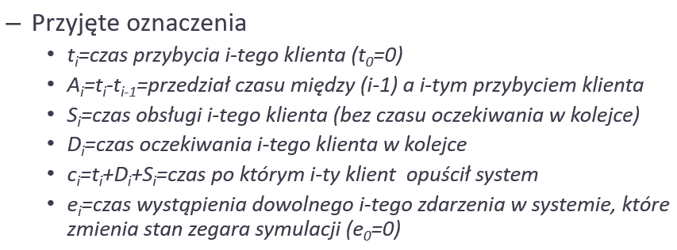

Zmienne A i S, to zmienne losowe.

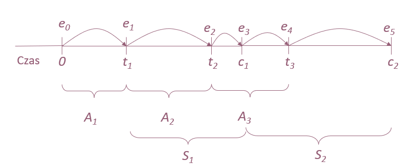

e1 = 0 + A1

## 7.3 Moduły modelu symulacyjnego

- stan systemu
  - Zbiór zmiennych opisujących stan systemu w poszczególnych chwilach czasowych
- zegar symulacji
  - bieżący czas symulacji
- lista zdarzeń
  - lista zawierająca czas wystąpienia kolejnego zdarzenia w systemie dla każdego z typów zdarzeń
- algorytm inicjalizujący
  - inicjulizuje model w chwili `zegar symulacji` = 0
- algorytm czasowy
  - określa kolejne zdarzenie z listy zdarzeń i zwiększa zegar symulacji na czas wystąpienia tego zdarzenia
- algorytm zdarzeniowy
  - uaktulania stan systemu, kiedy wystąpi kolejne zdarzenie, planuje kolejne zdarzenie
- algorytm bibliotek
  - zbiór bibliotek do generowania zmiennych losowych (A i S)
- generator raportów
  - oblicza charakterystyki systemu na podstawie zmierzonych wartości i generuje raport po zakończeniu symulacji
- program główny
  - wywołuje to wszystko

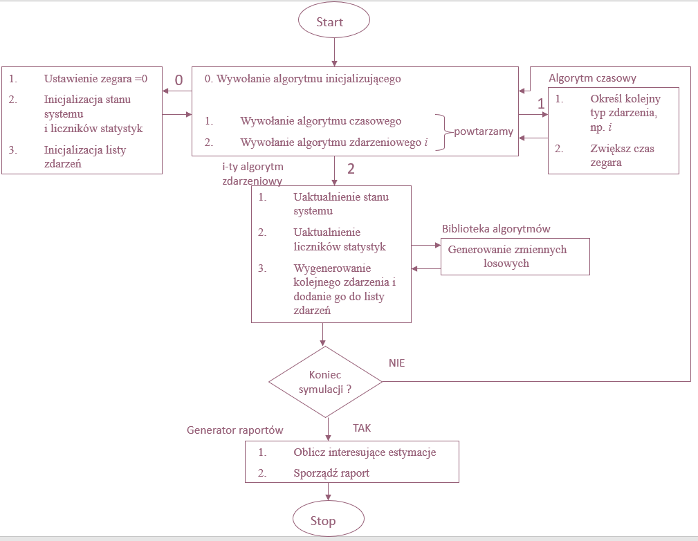

> o pobraniu zdarzenia z listy uaktualniamy czas zegara symulacji
>
> uaktualnienie stanu systemu - jak przybywa klient to albo zajmuje serwer albo trafia do kolejki
>
> wyegenrowanie kolejnego -- generujemy wartosc z jaka przyjdzie nastepne zdarzenie (nie odczytujemy ją z jakiejś tablicy)
>
> na liscie zdarzen jest tylko zdarzenie i dopiero po pobraniu zdarzenia tworzymy tego klienta, ten pakiet a nie ze jego pobieramy z listy zdarzen
>
> > Dodaj opcje ze mozna zatrzymac symulacje i podejrzec staty

## 7.4 Tworzenie listy zdarzeń

### Definicja problemu

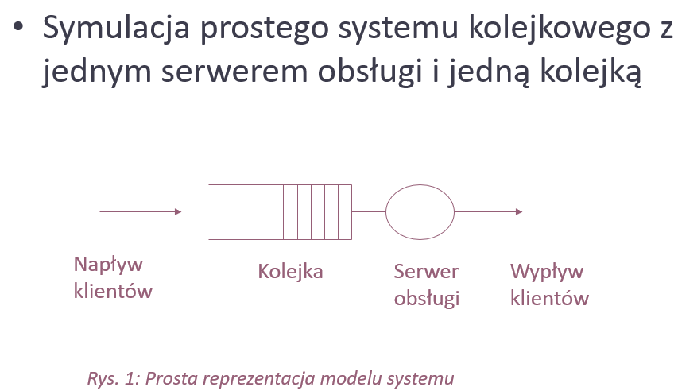

#### Założenia

- Odstępy (A), między przybywającymi klientami są niezależne - zmienne losowe
- Czasy obsługi klientów - zmienne losowe, niezależne od czasu przybycia klientów
- System obsługi -> FIFO
- Symulacja kończe się po przejściu n-tego klienta do obsługi

#### Szacowane charakterystyki

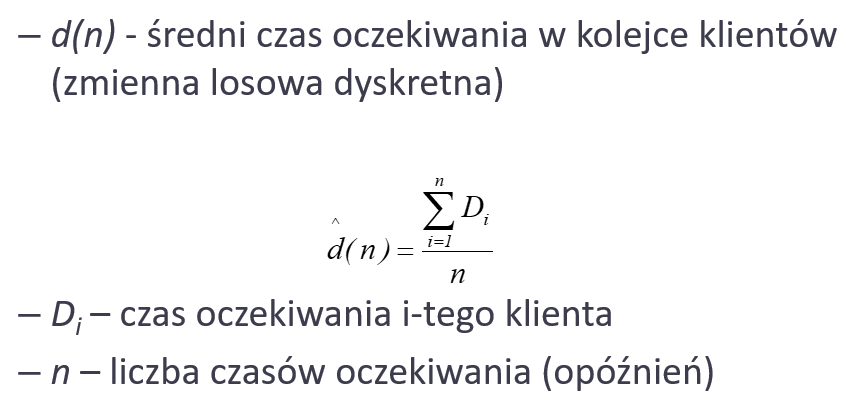

dodajemy czasy oczekiwania każdego klienta i na koniec dzielimy przez ich liczbe

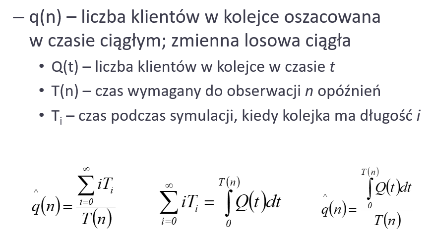

> non stop zbieramy ile w kazdym czasie bylo pakietow w kolejce
>
> i - liczba klientów
>
> Ti - ile czasu kolejka ma dlugosc i
>
> n - to jest wszystko w funkcji przybywania n-tego klienta.
>
> czyli zebranie ile jest klientow w kazdej sekundzie czasu, zeby miec taki ciagly wykres
>
> no i wtedy calke liczy sie izi, bo liczysz prostokaty `liczba_pakietow_w_kolejce * dlugosc przez ile czasu tak jest`

> liczba opóźnień - liczba czasów oczekiwań nasze `n`
>
> calkowite opoxnienie - D(n)/n
>
> obszar ponizej Q(t) -
>
> obszar poniżej B(t) - na biezaco podajemy state zajetsoci serwera

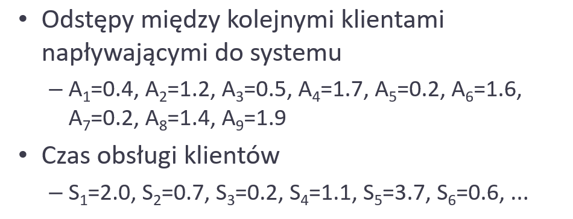

# 8 M/M/1

> Bazowy system to M/M/1, od niego zacznijcie

## 8.1 Planowanie zdarzeń

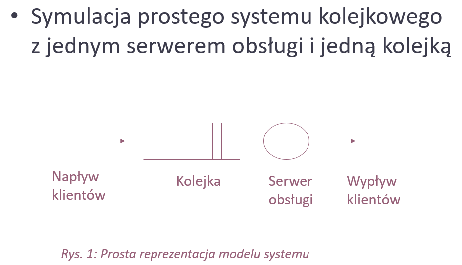

> 
>
> Obiążenie nie moze byc wieksze niz 1

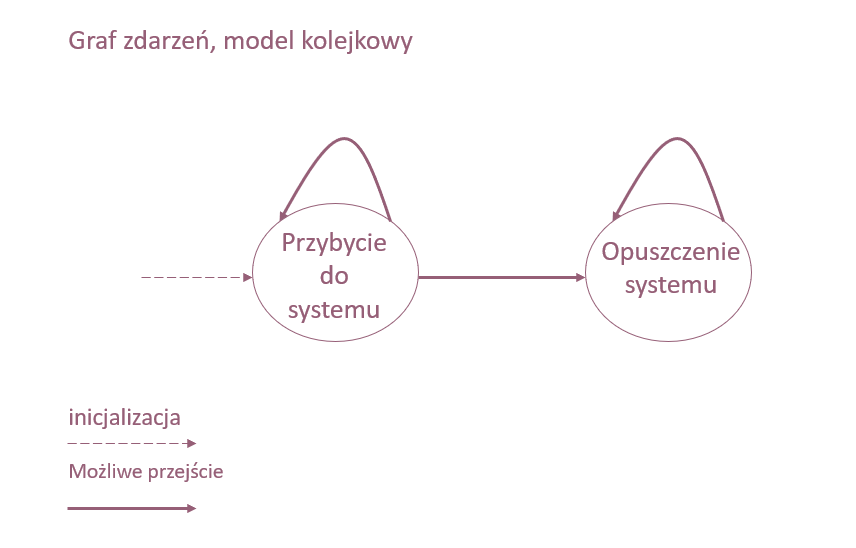

W momencie ściągnięcia danego typu zdarzenia, algorytm czasowy generuje następne wydarzenie tego typu.

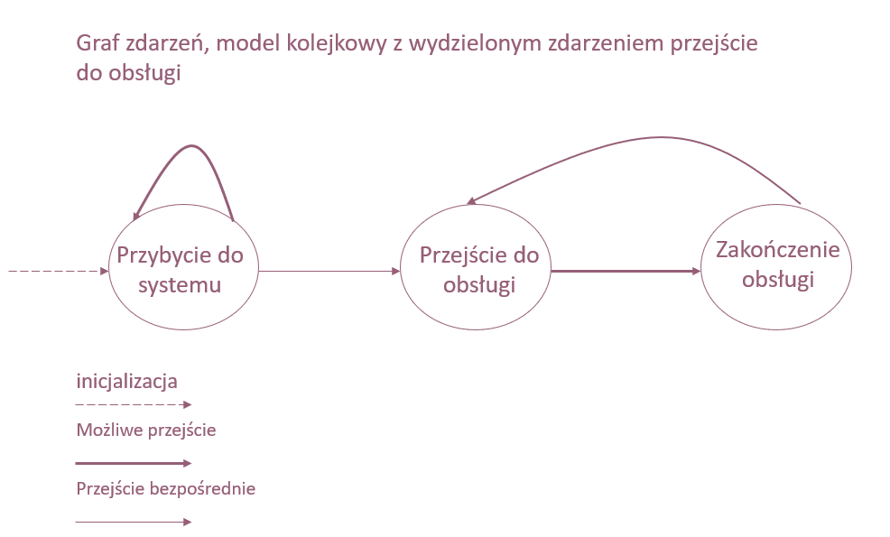

planowanie zdarzen są różne sposoby nie ma sensu tworzyc zdarzenie przejście do obsługi

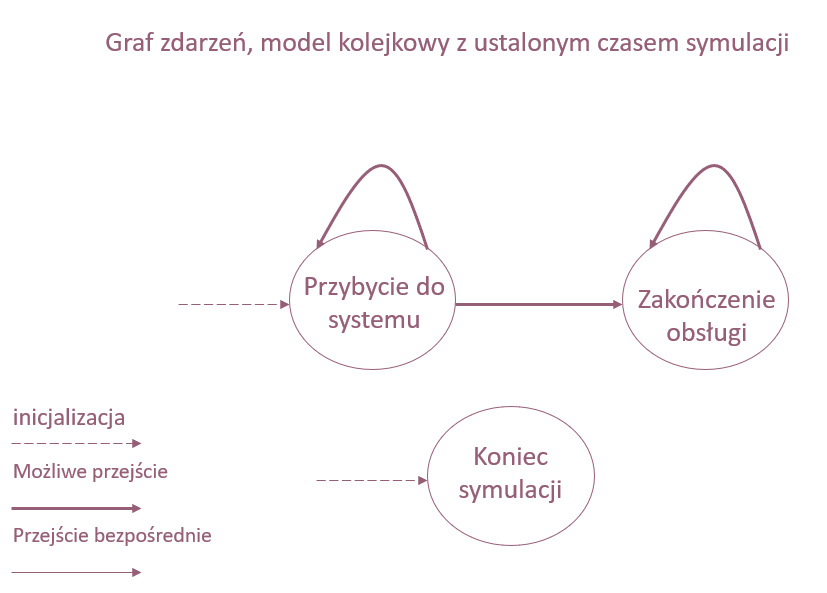

Czas symulacji powinien byc na tyle dlugi (nie zawsze okreslony przez czas), zeby pokazaly sie modele analityczne jakie oczkujemy

## 8.2 System M/M/1

Symulacja, która ma jakiekolwiek losowe elementy musi angażować pewne próbki lub generować liczby losowe z rozkładów p-stwa

Rozkłady są często wynikiem dopasowania pewnych rozkład (wykładniczy, Poissona) do danych z obserwacji rzeczywistego systemu

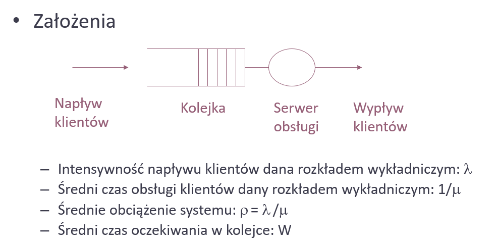

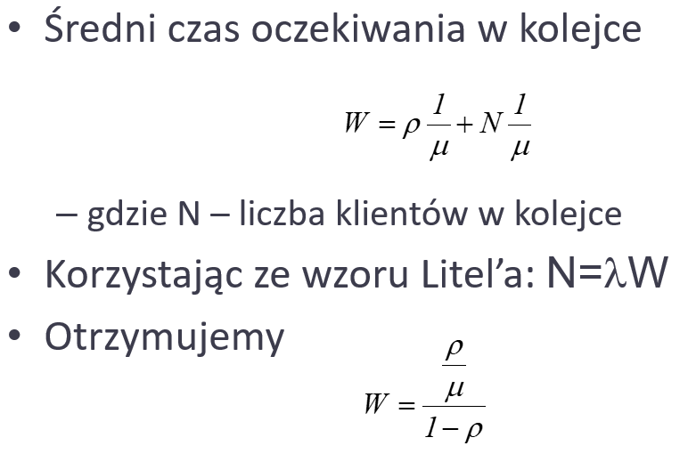

Wyniki symulacji powinny zgadzać się z tego co wychodzi matematycznie. Jeśli się zgadza znaczy, że jest git i można implementować dalej (rozwinąć M/M/1 o WRR itp.). Pamiętaj, że czas symulacji musi być odpowiednio długi.

## 8.3 Lista zdarzeń

Są dwa typu zdarzeń:

- przybycie klienta do systemu
- zakończenie obsługi klienta przez serwer ---> opuszczenie systemu przez klienta

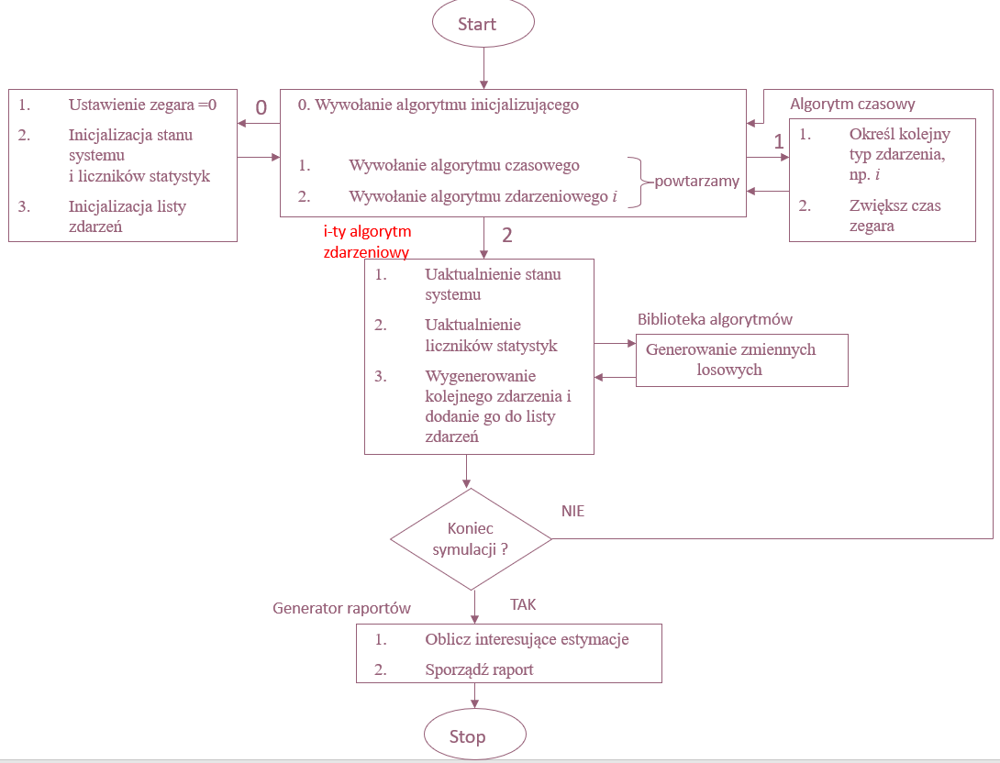

Algorytm czasowy zdejmuje zdarzenie z listy zdarzeń (liczba elementów (poza T-0) na liście powinna być równa liczbie typów zdarzeń) i uaktualnia czas symulacji (T).

Algorytmów zdarzeniowych jest tyle ile typów zdarzeń.

### Przybycie klienta do systemu

Algorytm zdarzeniowy dla zdarzenia przybycia klienta.

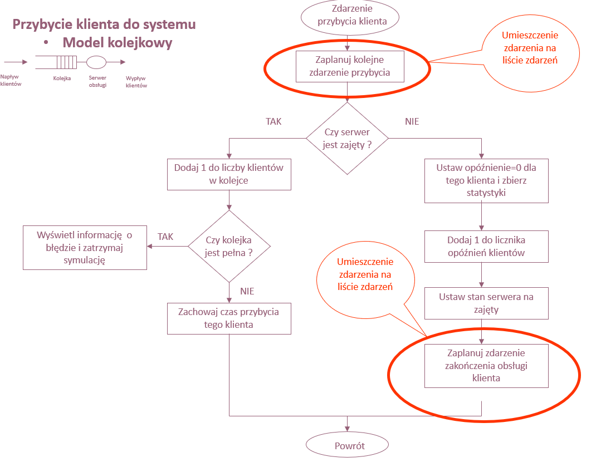

Algorytm dostaje zdarzenie, planuje następne zdarzenie tego typu (używa bilioteki do wygenerowania czasu następnego zdarzenia i dodaje do listy zdarzen).

Potem patrzy na stan serwera:

-  jeśli BUSY, to do kolejki dodawany jest klient i zapisywany jest czas przybycie tego klienta (żeby potem obliczyć opóźnienie).

- Jeśli FREE to
  -  gromadzone są staty (inkrementacja licznika obsłużonych klientów i opóźnienie dla klienta=0)
  - stan serwera ustawiany na BUSY
  - zaplanowanie zdarzenia obsługi klienta

### Opuszczenie serwera

Algorytm zdarzeniowy dla zdarzenia opuszczenia serwera przez klienta

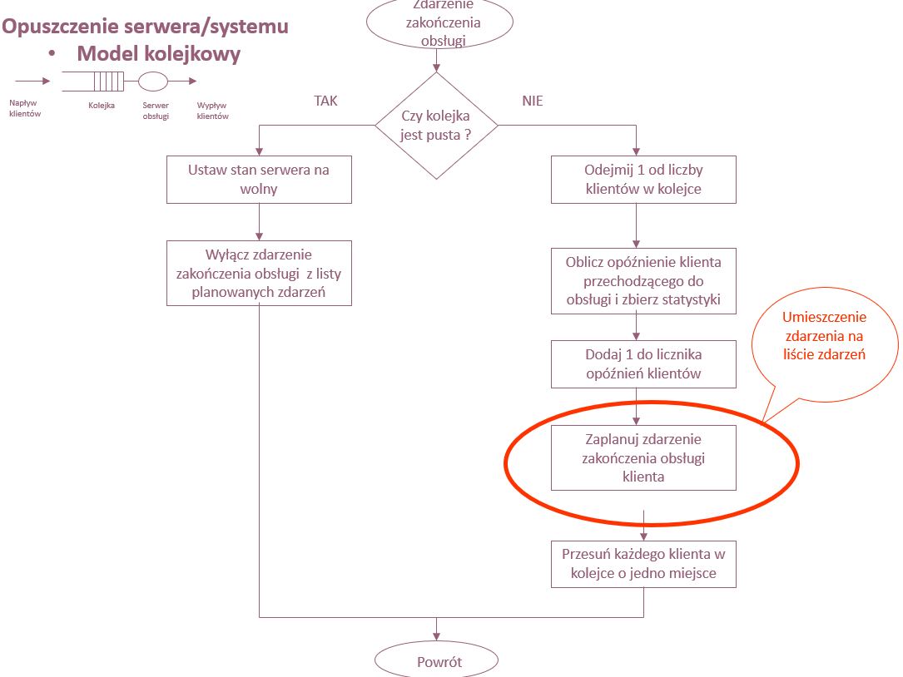

Algorytm dostaje zdarzenie. 

Sprawdza czy kolejka jest pusta czy nie:

- Jeśli TAK
  - ustawia stan serwera na wolny

- Jeśli NIE
  - dekrementacja liczby klientów w kolejce
  - zbiera staty - oblicza czas jaki klient spędził w kolejce, inkrementuje licznik obsłużonych klientów
  - zaplanowanie zdarzenia obsługi klienta
  - poprzesuwanie klientów w kolejce (tu jest FIFO, więc ez)

> Czyli kolejka to Queue<client>. Client to obiekt, który ma jako pole `arrival_time`

## 8.4 Generowanie wartości zmiennych losowych

Symulacja systemów o parametrach wejściowych opisanych pewnymi zmiennymi losowymi wymaga określenia rozkład p-stwa tych zmiennych.

w M/M/1 będą to zmienne losowe opisujące:

- odstępy czasowe między klientami napływającymi do systemu kolejkowego
- czas obsługi klientów przez serwer

Więc założenie jest takie, że parametrem wejściowym modelu symulacyjnego jest dany rozkład i potem zmienne losowe są generowane zgodnie z przyjętym rozkładem.

//TODO

